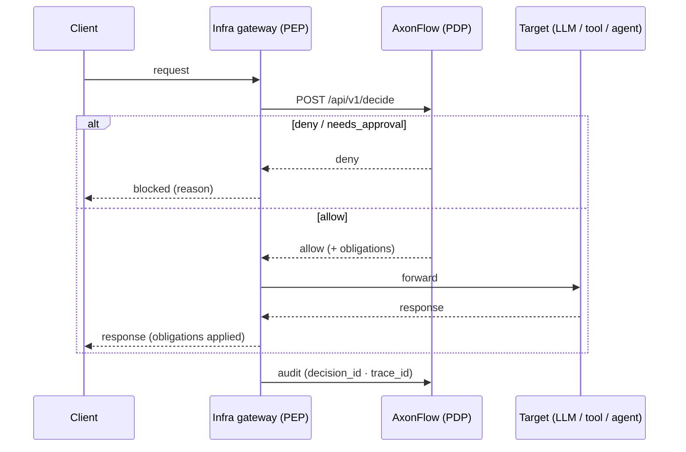
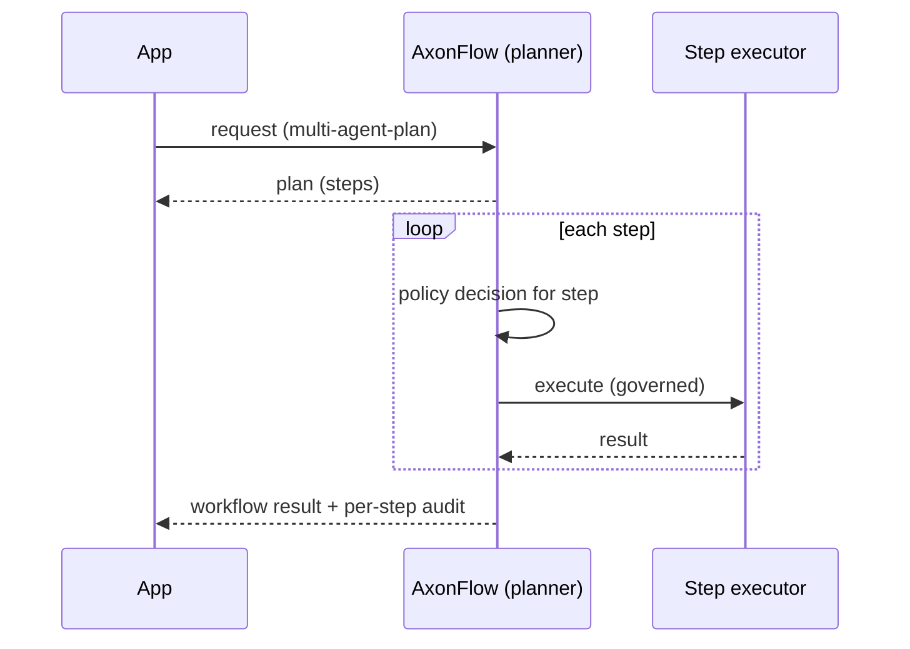
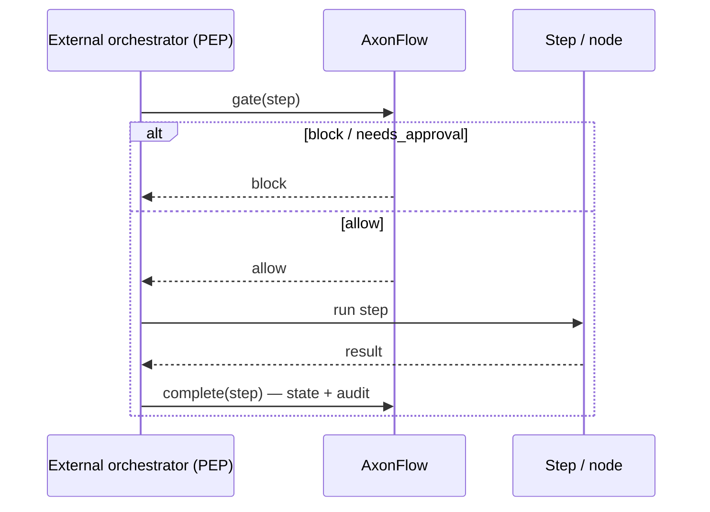
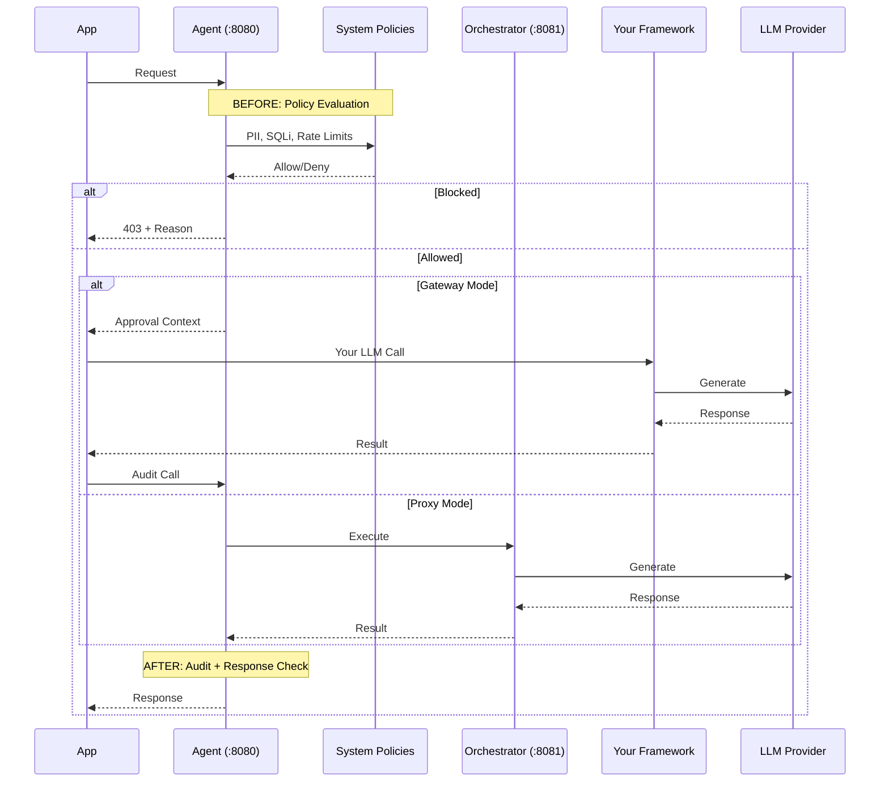
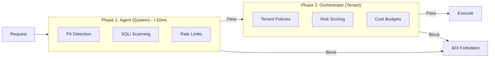

# AxonFlow Architecture

> Technical architecture reference for developers working with the AxonFlow codebase.
> For user-facing documentation, see [docs.getaxonflow.com/docs/architecture/overview](https://docs.getaxonflow.com/docs/architecture/overview).

---

## The Problem: Why Execution Breaks

Most agent frameworks optimize for **authoring** workflows, not **operating** them.

Once agents touch real systems, teams hit familiar problems:

- **Silent failures** — An agent retries a database write 3 times, each with side effects
- **No runtime visibility** — Which policy blocked the request? What was the LLM's reasoning?
- **Permission gaps** — Agent accessed customer data it shouldn't have; discovered in prod
- **Compliance gaps** — No audit trail for AI decisions; fails regulatory review

**Gateways aren't enough.** API gateways can rate-limit and authenticate, but they don't understand AI workflows. They can't enforce "block if PII detected" or "require approval for high-risk decisions."

AxonFlow treats agents as long-running, stateful systems that require governance, observability, and control at runtime — not just good prompts.

---

## Where AxonFlow Sits

AxonFlow is a **control plane**, not an orchestration framework. It doesn't replace LangChain or CrewAI — it makes them operable in production.

```
┌─────────────┐    ┌──────────────────────────────────────────────────┐
│  Your App   │───▶│                Agent (:8080)                     │
│   (SDK)     │    │  ┌──────────┐ ┌──────────┐ ┌──────────────────┐ │
└─────────────┘    │  │  Policy  │ │   MCP    │ │  Media / Code    │ │
                   │  │  Engine  │ │Connectors│ │  Governance      │ │
                   │  │  (60+)   │ │          │ │                  │ │
                   │  └──────────┘ └──────────┘ └──────────────────┘ │
                   │  ┌──────────────────┐ ┌─────────────────────┐   │
                   │  │ PII / SQLi       │ │ Circuit Breaker     │   │
                   │  │ Detection        │ │ (Kill Switch)       │   │
                   │  └──────────────────┘ └─────────────────────┘   │
                   └────────────────────┬─────────────────────────────┘
                                        │
                                        ▼
                   ┌──────────────────────────────────────────────────┐
                   │             Orchestrator (:8081)                 │
                   │  ┌──────────┐ ┌──────────┐ ┌──────────────────┐ │
                   │  │   WCP    │ │  MAP     │ │  Cost Controls   │ │
                   │  │  Step    │ │  Plan +  │ │  & Multi-Model   │ │
                   │  │  Gates   │ │  Execute │ │  Routing         │ │
                   │  └──────────┘ └──────────┘ └──────────────────┘ │
                   │  ┌──────────────────┐ ┌─────────────────────┐   │
                   │  │ HITL Approval    │ │ Evidence Export      │   │
                   │  │ Gates            │ │ & Decision Replay    │   │
                   │  └──────────────────┘ └─────────────────────┘   │
                   └────────────────────┬─────────────────────────────┘
                                        │
                                        ▼
                   ┌──────────────────────────────────────────────────┐
                   │                 LLM Providers                    │
                   │   (OpenAI, Anthropic, Gemini, Bedrock, Ollama)   │
                   └──────────────────────────────────────────────────┘

           PostgreSQL (policies, audit, evidence) • Redis (cache)
                   MCP Connectors (Postgres, Salesforce, S3, ...)
```

**AxonFlow provides:**
- **Policy enforcement** — Block PII, SQLi, dangerous queries before they reach LLMs
- **Media and code governance** — Image classification, code scanning policies
- **Workflow Control Plane (WCP)** — Step-level gates for external orchestrators (LangChain, Temporal, etc.)
- **Circuit breaker** — Emergency kill switch to halt all LLM calls instantly
- **Audit logging** — Complete trail of every AI decision for compliance
- **Evidence export and decision replay** — Compliance-grade exports and step-by-step replay
- **Cost controls** — Budget limits and usage tracking per tenant
- **HITL approval gates** — Human review for high-risk decisions

### Gateway Mode (Recommended for Existing Stacks)

AxonFlow wraps your existing agent framework with pre-execution checks and post-execution audit:

```
┌──────────────────────────────────────────────────────────────────────────────┐
│                              GATEWAY MODE                                     │
│                                                                               │
│   ┌─────────┐      ┌─────────────┐      ┌───────────────────────────────┐    │
│   │         │ ───▶ │  AxonFlow   │ ───▶ │  Your Agent Framework         │    │
│   │   App   │      │  Pre-check  │      │  (LangChain / CrewAI / etc)   │    │
│   │         │      │             │      │              │                │    │
│   └─────────┘      └─────────────┘      │              ▼                │    │
│        ▲                                │         ┌─────────┐           │    │
│        │                                │         │   LLM   │           │    │
│        │                                │         │Provider │           │    │
│        │                                │         └────┬────┘           │    │
│        │           ┌─────────────┐      │              │                │    │
│        └────────── │  AxonFlow   │ ◀─── │              ▼                │    │
│                    │   Audit     │      │         Response              │    │
│                    └─────────────┘      └───────────────────────────────┘    │
│                                                                               │
│   Flow: Pre-check → Your LLM call → Audit                                    │
│   Latency overhead: ~15ms                                                     │
└──────────────────────────────────────────────────────────────────────────────┘
```

**Code:**
```python
# 1. Pre-check: Get policy approval
approval = await axonflow.get_policy_approved_context(query)
if not approval.approved:
    raise PolicyViolation(approval.block_reason)

# 2. Your existing LLM call (LangChain, CrewAI, etc.)
response = await your_langchain_agent.run(query)

# 3. Audit: Record what happened
await axonflow.audit_llm_call(approval.context_id, response)
```

**Use when:** You already have LangChain/CrewAI/AutoGen agents and want to add governance.

### Proxy Mode (Full Control)

AxonFlow handles the complete request lifecycle, including LLM calls:

```
┌──────────────────────────────────────────────────────────────────────────────┐
│                               PROXY MODE                                      │
│                                                                               │
│   ┌─────────┐      ┌─────────────────────────────────────────┐      ┌─────┐  │
│   │         │      │              AxonFlow                    │      │     │  │
│   │   App   │ ───▶ │  ┌────────┐    ┌────────┐    ┌───────┐  │ ───▶ │ LLM │  │
│   │         │      │  │ Policy │───▶│  MAP   │───▶│Router │  │      │     │  │
│   │         │      │  │ Engine │    │Planning│    │       │  │      │     │  │
│   └─────────┘      │  └────────┘    └────────┘    └───────┘  │      └──┬──┘  │
│        ▲           │                                          │         │     │
│        │           │  ┌────────┐    ┌────────┐    ┌───────┐  │         │     │
│        └────────── │  │ Audit  │◀───│Response│◀───│ Cost  │  │ ◀───────┘     │
│                    │  │  Log   │    │ Check  │    │Control│  │               │
│                    │  └────────┘    └────────┘    └───────┘  │               │
│                    └─────────────────────────────────────────┘               │
│                                                                               │
│   Flow: App → AxonFlow (everything) → LLM → AxonFlow → App                   │
│   Full governance: policies, planning, routing, cost, audit                   │
└──────────────────────────────────────────────────────────────────────────────┘
```

**Code:**
```python
# AxonFlow handles everything
response = await axonflow.execute_query(
    query="Analyze customer sentiment for Q4",
    request_type="analysis"
)
# Policies, LLM routing, cost tracking, audit — all handled
```

**Use when:** Building new applications, need full governance from the start.

---

## The Five Runtime Modes

AxonFlow is a **policy plane** for AI execution: at the point where an agent, model, or workflow is about to do something consequential, it **decides, enforces, redacts, and records** that action against your policies. There are five ways to wire that in. They differ only in *who calls AxonFlow* and *where AxonFlow sits relative to the traffic* — the governed-call lifecycle (decide → allow/deny/redact → audit, fail-closed) is identical across all five.

The split that makes this work is **PEP / PDP**: AxonFlow is the **Policy Decision Point** (it returns a verdict), and the integration is the **Policy Enforcement Point** (it acts on the verdict).

| Mode | Who calls AxonFlow | Traffic path | Endpoint(s) | When to use |
|---|---|---|---|---|
| **Decision Mode** | Your infra **gateway** | Client → gateway → target (verdict checked inline) | `POST /api/v1/decide` | Gateway-level enforcement with **no app-code changes** |
| **Gateway** | Your **app code** (SDK) | App → LLM (direct) | `POST /api/policy/pre-check`, `POST /api/audit/llm-call` | Adding governance to an existing app/framework, least invasive |
| **Proxy** | Your **app code** (one call) | App → AxonFlow → LLM | `POST /api/request` | New apps wanting AxonFlow to own routing + the LLM call |
| **MAP** (Multi-Agent Planning) | Your **app code** | App → AxonFlow plans + executes | Orchestrator planning API | Decomposing a request into a governed multi-step plan |
| **WCP** (Workflow Control Plane) | Your **external orchestrator** | Orchestrator → AxonFlow gates each step | `workflow_control/` step gate + complete | Step-level gates beside LangGraph / n8n / Temporal |

> The public, user-facing version of this model — with a per-integration coverage matrix — lives at [docs.getaxonflow.com/docs/architecture/governance-coverage](https://docs.getaxonflow.com/docs/architecture/governance-coverage). This section is the engineering source that page derives from.

### Decision Mode — gateway-level governance, no app changes

Your infrastructure gateway (LLM gateway, MCP gateway, agent router) asks AxonFlow for a verdict on each request and enforces it locally. AxonFlow is **never on the traffic path** — it is consulted for decisions only. This is the lowest-touch way to govern many apps at once: application code is unchanged; the gateway does the enforcing.



**Endpoint:** `POST /api/v1/decide` (`stage` = llm / tool / agent). Reference PEP adapters ship for **LLM**, **MCP** (`tools/call`), and **agent** gateways. **Code:** `platform/agent/decision_handler.go`. **See:** [ADR-056 — Decision Mode](../technical-docs/architecture-decisions/ADR-056-decision-mode.md).

**Obligations are fulfilled by AxonFlow's engine, never by the client.** `/api/v1/decide` is a pure decision: it returns a verdict plus **obligations** and **never mutates content** — it does not return a redacted request or the response. An obligation is **self-describing**: a `redact_pii` obligation carries a `fulfillment` block naming the *engine endpoint* the PEP must call to discharge it, the phase, and the content types the engine can handle:

```json
{ "type": "redact_pii", "detail": "...",
  "fulfillment": { "endpoint": "/api/v1/mcp/check-input", "method": "POST",
                   "phase": "request", "content_types": ["text/plain"] } }
```

The blessed PEP path is **decide → fulfill via the named endpoint → forward**. Request-phase and response-phase redaction are a symmetric pair: **`POST /api/v1/mcp/check-input`** returns an engine-redacted request (`redacted_statement`), **`POST /api/v1/mcp/check-output`** returns an engine-redacted response (`redacted_data`). Reference PEPs use the thin `platform/shared/pep` client, whose **only** redaction path is that engine round-trip — it carries no PII patterns and **fails closed** if an obligation cannot be discharged through the engine. Client-side redaction is forbidden structurally, not by convention.

What the docs deliberately do **not** claim is "one engine does all PII." PII detection is split across several detectors (a static text-category engine, an enterprise Indonesia checksum detector, an orchestrator response detector, and a media subsystem); the redaction contract is **content-type-agnostic** and dispatches each obligation to whichever detector is authoritative for that content type and phase. A content type with no registered detector is rejected (`415`) and a PEP holding it **fails closed** rather than forwarding ungoverned (today only `text/plain` is wired; media content routes to the orchestrator's existing media-governance subsystem, not a re-implementation). Coverage is **policy-derived** — the PII categories your active policies enable (by the `pii-*` convention), not a hardcoded list — so a new jurisdiction is covered without code changes. Gateway/PDP detection is **connector-agnostic**: AxonFlow governs whatever content the PEP submits, regardless of backend, so there is no "enabled connector" prerequisite for gateway redaction.

### MAP — Multi-Agent Planning

AxonFlow decomposes a natural-language request into a multi-step plan, then executes the steps with a policy decision **at each step**, with replay/resume and optional approval gates.



**Code:** `platform/orchestrator/planning_engine.go` (plan generation), with per-step decisions recorded to the decision chain (`platform/agent/decision_chain.go`).

### WCP — Workflow Control Plane

Your external orchestrator (LangGraph, n8n, Temporal, Airflow) keeps running the workflow; AxonFlow adds a **gate before each step** and a **completion record after**, plus checkpoints and approvals — without replacing the orchestration engine.



**Code:** `platform/orchestrator/workflow_control/` (step gates + completion + checkpoints). **See:** [ADR-028 — Workflow Control Plane](../technical-docs/architecture-decisions/ADR-028-workflow-control-plane.md).

### Gateway & Proxy

**Gateway Mode** and **Proxy Mode** are covered in detail above ([Gateway Mode](#gateway-mode-recommended-for-existing-stacks), [Proxy Mode](#proxy-mode-full-control)); their combined request/audit sequence is in [Execution Model → Policies Before and After Steps](#policies-before-and-after-steps). The LLM-architecture rationale for the Gateway-default / optional-full-Proxy split is in [ADR-004 — LLM Architecture](../technical-docs/architecture-decisions/ADR-004-llm-architecture-governance.md).

---

## Control Plane vs Orchestration

| Aspect | Orchestration (LangChain) | Control Plane (AxonFlow) |
|--------|---------------------------|--------------------------|
| **Focus** | Chain construction, prompts | Runtime governance, audit |
| **When** | Authoring time | Execution time |
| **Concern** | "How do I build this workflow?" | "Should this step be allowed to run?" |
| **Output** | LLM response | Allow/Block decision + audit trail |

**The key insight:** AxonFlow doesn't compete with LangChain. LangChain runs your workflow; AxonFlow decides whether each step is allowed to proceed.

---

## Execution Model

### Policies Before and After Steps

Every step in a workflow passes through policy evaluation:



### Two-Phase Policy Model

AxonFlow uses a two-phase policy model for both LLM calls and MCP connector access:



**Phase 1 (System Policies):** Compiled patterns, in-memory, no DB lookups. Code: `platform/agent/static_policies.go`

**Phase 2 (Tenant Policies):** Tenant-aware, cached 5 minutes. Code: `platform/orchestrator/dynamic_policy_engine.go`

| Access Type | Phase 1 (System) | Phase 2 (Tenant) |
|-------------|------------------|------------------|
| **LLM - Proxy Mode** | ✅ | ✅ |
| **LLM - Gateway Mode** | ✅ | ❌ (you handle LLM directly) |
| **MCP Connectors** | ✅ | ✅ (when `MCP_DYNAMIC_POLICIES_ENABLED=true`) |

> **Note:** MCP connectors are evaluated independently from LLM mode selection. You can use Gateway Mode for LLM calls (lowest latency) while still having full two-phase policy evaluation on MCP connector access. See `platform/agent/mcp_handler.go` for MCP policy flow.

### Human-in-the-Loop Approvals (Enterprise)

High-risk decisions can require human approval:

```
Request → Policy Check → HITL Queue → Human Approves → Execute → Audit
                              │
                              └── Human Rejects → Block + Audit
```

**Code:** `platform/agent/hitl/`

### Audit and Replay

Both modes provide audit logging, but with different depth:

**Gateway Mode (Lightweight Audit):**
- Stores pre-check context and LLM call metrics
- Captures: provider, model, tokens, cost, latency
- Response stored as SHA-256 hash (privacy-preserving)
- Designed for cost tracking and usage monitoring
- Code: `platform/agent/gateway_handlers.go`

**Proxy Mode (Comprehensive Audit - Decision Chain):**
- Complete step-by-step decision tracing
- Captures: policy triggers, risk levels, decision outcomes
- SHA-256 hashes for tamper detection (`input_hash`, `output_hash`, `audit_hash`)
- EU AI Act Article 12 compliant (risk classification per decision)
- Supports workflow reconstruction via `chain_id` + `step_number`
- Tracks human review requirements
- Code: `platform/agent/decision_chain.go`

```go
// Decision chain entry (simplified)
type DecisionEntry struct {
    ChainID        string    // Links all decisions in a workflow
    RequestID      string
    StepNumber     int       // Order within chain
    DecisionType   string    // policy_enforcement, llm_generation, etc.
    DecisionOutcome string   // approved, blocked, modified
    RiskLevel      string    // minimal, limited, high, unacceptable
    PolicyTriggered string   // Which policy caused block/modify
    Hash           string    // SHA-256 for tamper detection
}
```

**Execution Replay** (Proxy Mode only) allows stepping through a request's decision history for debugging or compliance audits.

**Code:** `platform/orchestrator/replay/`

### Multi-Agent Planning (MAP)

MAP turns natural language requests into executable workflows:

```yaml
# agents/travel.yaml
domain: travel
agents:
  - name: flight-search
    capabilities: [search_flights, compare_prices]
  - name: booking
    capabilities: [reserve, confirm, cancel]
    requires_approval: true  # HITL for booking actions
```

```python
# Natural language → Workflow
plan = await axonflow.generate_plan("Book cheapest flight to London next Tuesday")
# Returns: [flight-search.search, flight-search.compare, booking.reserve]
```

**Code:** `platform/orchestrator/planning_engine.go`

---

## Core Services

### System Components

```
┌─────────────────────────────────────────────────────────────────────────────┐
│                           AXONFLOW COMPONENTS                                │
│                                                                              │
│                              ┌─────────────────────────────────────────┐    │
│                              │          LLM Providers                   │    │
│                              │  ┌─────────┐ ┌─────────┐ ┌─────────┐   │    │
│                              │  │ OpenAI  │ │Anthropic│ │ Gemini  │   │    │
│                              │  └─────────┘ └─────────┘ └─────────┘   │    │
│                              │  ┌─────────┐ ┌─────────┐ ┌─────────┐   │    │
│                              │  │ Azure   │ │ Ollama  │ │ Bedrock │   │    │
│                              │  └─────────┘ └─────────┘ └─────────┘   │    │
│                              └──────────────────▲──────────────────────┘    │
│                                                 │                            │
│   ┌─────────┐      ┌──────────────────┐      ┌──────────────────┐          │
│   │         │      │  Agent (:8080)   │      │Orchestrator(:8081)│          │
│   │   App   │─────▶│                  │─────▶│                  │──────────┤
│   │         │      │  • System Policy │      │  • Tenant Policy  │          │
│   └─────────┘      │  • PII Detection │      │  • LLM Routing    │          │
│                    │  • SQLi Scanning │      │  • Cost Controls  │          │
│                    │  • Rate Limits   │      │  • MAP Planning   │          │
│                    │  • Gateway APIs  │      │  • WCP Step Gates │          │
│                    │  • MCP Handler   │      │  • HITL Approvals │          │
│                    │  • Media / Code  │      │  • Evidence Export │          │
│                    │    Governance    │      │  • Decision Replay │          │
│                    │  • Circuit Break │      │                    │          │
│                    └────────┬─────────┘      └─────────┬──────────┘          │
│                             │                          │                     │
│                             │    ┌─────────────────────┘                     │
│                             │    │                                           │
│                             ▼    ▼                                           │
│                    ┌─────────────────────┐    ┌──────────────────┐          │
│                    │  PostgreSQL (:5432) │    │   Redis (:6379)  │          │
│                    │                     │    │                  │          │
│                    │  • Policies         │    │  • Rate Limits   │          │
│                    │  • Audit Logs       │    │  • Policy Cache  │          │
│                    │  • Cost Budgets     │    │  • Session State │          │
│                    │  • Evidence         │    │  • Circuit State │          │
│                    │  • Workflow Steps   │    │                  │          │
│                    │  • Tenant Config    │    │                  │          │
│                    └─────────────────────┘    └──────────────────┘          │
│                                                                              │
│   docker compose up -d                                                       │
└─────────────────────────────────────────────────────────────────────────────┘
```

**Data Flow:**
1. **App → Agent**: All requests enter through the Agent on port 8080
2. **Agent → Orchestrator**: In Proxy Mode, approved requests route to Orchestrator for LLM execution
3. **Agent ↔ Postgres**: System policies loaded at startup, audit logs written per-request
4. **Agent ↔ Redis**: Rate limit counters, policy cache (5-min TTL)
5. **Orchestrator → LLM**: Routes to configured providers based on cost, latency, or policy rules

### Agent Service (`:8080`)

**Location:** `platform/agent/`

| Component | File | Purpose |
|-----------|------|---------|
| Entry point | `run.go` | HTTP server, middleware |
| System policies | `static_policies.go` | PII, SQLi, rate limits |
| Gateway handlers | `gateway_handlers.go` | Pre-check / Audit APIs |
| MCP handler | `mcp_handler.go` | Connector orchestration |
| Circuit breaker | `circuitbreaker/` | Emergency kill switch (Evaluation+) |
| Decision chain | `decision_chain.go` | Audit trail |

### Orchestrator Service (`:8081`)

**Location:** `platform/orchestrator/`

| Component | File | Purpose |
|-----------|------|---------|
| Entry point | `run.go` | Service initialization |
| Tenant policies | `dynamic_policy_engine.go` | Configurable rules, risk |
| LLM routing | `llm/router.go` | Provider selection |
| Planning engine | `planning_engine.go` | MAP |
| WCP handlers | `workflow_control/` | Step gates, workflow lifecycle |
| Cost controls | `cost/` | Budget management |
| HITL approvals | `hitl_wcp_community.go` | Approval queue, expiry (Evaluation+) |
| Media governance | `media_governance_handlers.go`, `media/` | Image classification, content policies |
| Evidence export | `evidence_export_handler.go` | Compliance exports (Evaluation+) |
| Replay | `replay/` | Execution debugging |

### Shared Policy Engine

**Location:** `platform/shared/policy/`

Unified policy evaluation for MCP INPUT/OUTPUT checks.

| File | Purpose |
|------|---------|
| `engine.go` | Central evaluation |
| `evaluator.go` | Condition matching |
| `redactor.go` | PII redaction |
| `cache.go` | Thread-safe caching |

---

## What This Enables

### Scales Across Frameworks

Gateway Mode means you don't rewrite your agents. Add governance to LangChain today, CrewAI tomorrow, custom agents next month — same control plane.

### Governance Emerges Naturally

Policies are defined once, applied everywhere. A "block SSN in queries" policy works whether the request comes from a chatbot, a batch job, or an internal tool.

### Sticky in Production

Once you have audit trails, cost controls, and approval workflows, they become infrastructure. Teams build on top of them; removing them breaks things.

---

## Performance

| Operation | P95 Latency | Notes |
|-----------|-------------|-------|
| System Policy Evaluation | <10ms | In-memory |
| Tenant Policy Evaluation | <30ms | Cached |
| Gateway Pre-check | <15ms | System + context |
| MCP Connector Query | <50ms | Pooled connections |

---

## Directory Structure

```
platform/
├── agent/                    # Agent service (:8080)
│   ├── run.go
│   ├── static_policies.go
│   ├── gateway_handlers.go
│   ├── mcp_handler.go
│   ├── circuitbreaker/       # Emergency kill switch (Evaluation+)
│   ├── decision_chain.go
│   ├── sqli/
│   └── hitl/                 # Enterprise
│
├── orchestrator/             # Orchestrator service (:8081)
│   ├── run.go
│   ├── dynamic_policy_engine.go
│   ├── planning_engine.go
│   ├── workflow_engine.go
│   ├── workflow_control/     # WCP step gates
│   ├── media_governance_handlers.go # Media/code governance
│   ├── media_governance_config.go
│   ├── media/                  # Media analysis types
│   ├── evidence_export_handler.go  # Evaluation+
│   ├── hitl_wcp_community.go # HITL approval gates (Evaluation+)
│   ├── llm/
│   ├── cost/
│   └── replay/
│
├── connectors/               # MCP connectors
│   ├── postgres/
│   ├── mysql/
│   ├── mongodb/
│   └── ...
│
└── shared/
    └── policy/               # Unified policy engine
```

---

## Related Documentation

- [Getting Started](./getting-started.md)
- [SDK Feature Coverage](./SDK_FEATURE_COVERAGE.md)
- [Configuration](./configuration.md)
- [API Reference](./api/)

---

*For the full user-facing documentation, visit [docs.getaxonflow.com](https://docs.getaxonflow.com).*
