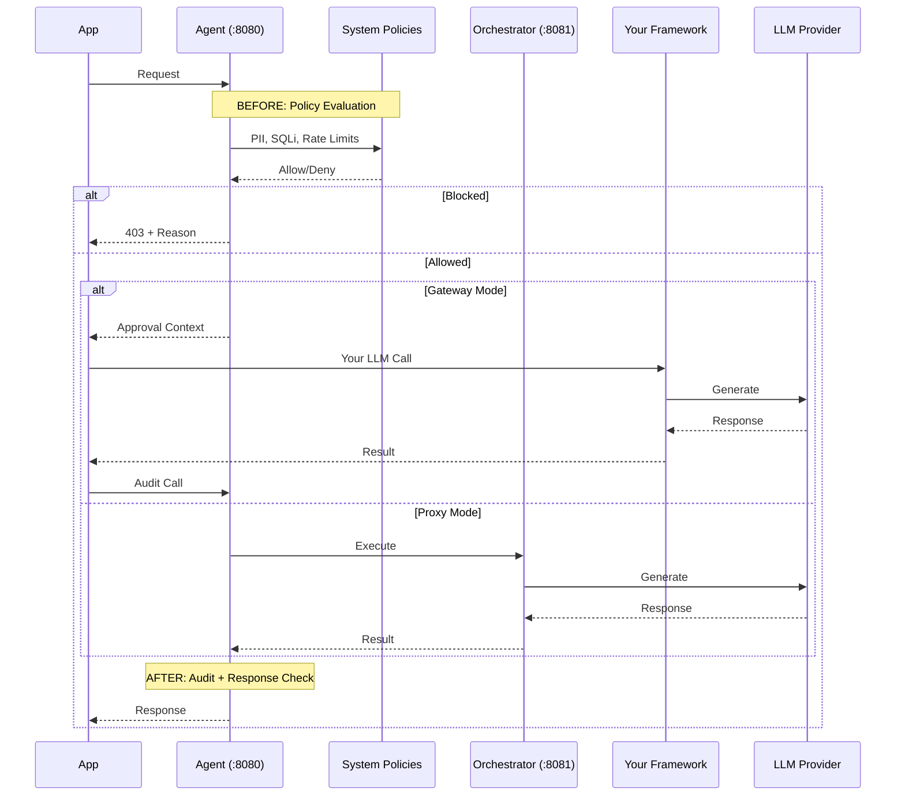
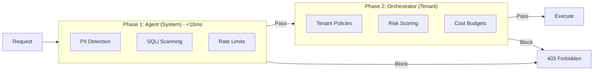

# AxonFlow Architecture

> Technical architecture reference for developers working with the AxonFlow codebase.
> For user-facing documentation, see [docs.getaxonflow.com/docs/architecture/overview](https://docs.getaxonflow.com/docs/architecture/overview).

---

## The Problem: Why Execution Breaks

Most agent frameworks optimize for **authoring** workflows, not **operating** them.

Once agents touch real systems, teams hit familiar problems:

- **Silent failures** — An agent retries a database write 3 times, each with side effects
- **No runtime visibility** — Which policy blocked the request? What was the LLM's reasoning?
- **Permission gaps** — Agent accessed customer data it shouldn't have; discovered in prod
- **Compliance gaps** — No audit trail for AI decisions; fails regulatory review

**Gateways aren't enough.** API gateways can rate-limit and authenticate, but they don't understand AI workflows. They can't enforce "block if PII detected" or "require approval for high-risk decisions."

AxonFlow treats agents as long-running, stateful systems that require governance, observability, and control at runtime — not just good prompts.

---

## Where AxonFlow Sits

AxonFlow is a **control plane**, not an orchestration framework. It doesn't replace LangChain or CrewAI — it makes them operable in production.

```
┌─────────────┐      ┌─────────────────────────────┐      ┌─────────────────┐
│             │      │          AxonFlow           │      │  LLM Providers  │
│    Your     │ ───▶ │  ┌─────────┐  ┌─────────┐  │ ───▶ │  OpenAI         │
│    App      │      │  │ Policy  │  │  Audit  │  │      │  Anthropic      │
│             │ ◀─── │  │ Engine  │  │   Log   │  │ ◀─── │  Gemini         │
└─────────────┘      │  └─────────┘  └─────────┘  │      └─────────────────┘
                     └─────────────────────────────┘
                                  │
                                  ▼
                     ┌─────────────────────────────┐
                     │      MCP Connectors         │
                     │  Postgres, Salesforce, S3   │
                     └─────────────────────────────┘
```

**AxonFlow provides:**
- **Policy enforcement** — Block PII, SQLi, dangerous queries before they reach LLMs
- **Audit logging** — Complete trail of every AI decision for compliance
- **Cost controls** — Budget limits and usage tracking per tenant

### Gateway Mode (Recommended for Existing Stacks)

AxonFlow wraps your existing agent framework with pre-execution checks and post-execution audit:

```
┌──────────────────────────────────────────────────────────────────────────────┐
│                              GATEWAY MODE                                     │
│                                                                               │
│   ┌─────────┐      ┌─────────────┐      ┌───────────────────────────────┐    │
│   │         │ ───▶ │  AxonFlow   │ ───▶ │  Your Agent Framework         │    │
│   │   App   │      │  Pre-check  │      │  (LangChain / CrewAI / etc)   │    │
│   │         │      │             │      │              │                │    │
│   └─────────┘      └─────────────┘      │              ▼                │    │
│        ▲                                │         ┌─────────┐           │    │
│        │                                │         │   LLM   │           │    │
│        │                                │         │Provider │           │    │
│        │                                │         └────┬────┘           │    │
│        │           ┌─────────────┐      │              │                │    │
│        └────────── │  AxonFlow   │ ◀─── │              ▼                │    │
│                    │   Audit     │      │         Response              │    │
│                    └─────────────┘      └───────────────────────────────┘    │
│                                                                               │
│   Flow: Pre-check → Your LLM call → Audit                                    │
│   Latency overhead: ~15ms                                                     │
└──────────────────────────────────────────────────────────────────────────────┘
```

**Code:**
```python
# 1. Pre-check: Get policy approval
approval = await axonflow.get_policy_approved_context(query)
if not approval.approved:
    raise PolicyViolation(approval.block_reason)

# 2. Your existing LLM call (LangChain, CrewAI, etc.)
response = await your_langchain_agent.run(query)

# 3. Audit: Record what happened
await axonflow.audit_llm_call(approval.context_id, response)
```

**Use when:** You already have LangChain/CrewAI/AutoGen agents and want to add governance.

### Proxy Mode (Full Control)

AxonFlow handles the complete request lifecycle, including LLM calls:

```
┌──────────────────────────────────────────────────────────────────────────────┐
│                               PROXY MODE                                      │
│                                                                               │
│   ┌─────────┐      ┌─────────────────────────────────────────┐      ┌─────┐  │
│   │         │      │              AxonFlow                    │      │     │  │
│   │   App   │ ───▶ │  ┌────────┐    ┌────────┐    ┌───────┐  │ ───▶ │ LLM │  │
│   │         │      │  │ Policy │───▶│  MAP   │───▶│Router │  │      │     │  │
│   │         │      │  │ Engine │    │Planning│    │       │  │      │     │  │
│   └─────────┘      │  └────────┘    └────────┘    └───────┘  │      └──┬──┘  │
│        ▲           │                                          │         │     │
│        │           │  ┌────────┐    ┌────────┐    ┌───────┐  │         │     │
│        └────────── │  │ Audit  │◀───│Response│◀───│ Cost  │  │ ◀───────┘     │
│                    │  │  Log   │    │ Check  │    │Control│  │               │
│                    │  └────────┘    └────────┘    └───────┘  │               │
│                    └─────────────────────────────────────────┘               │
│                                                                               │
│   Flow: App → AxonFlow (everything) → LLM → AxonFlow → App                   │
│   Full governance: policies, planning, routing, cost, audit                   │
└──────────────────────────────────────────────────────────────────────────────┘
```

**Code:**
```python
# AxonFlow handles everything
response = await axonflow.execute_query(
    query="Analyze customer sentiment for Q4",
    request_type="analysis"
)
# Policies, LLM routing, cost tracking, audit — all handled
```

**Use when:** Building new applications, need full governance from the start.

---

## Control Plane vs Orchestration

| Aspect | Orchestration (LangChain) | Control Plane (AxonFlow) |
|--------|---------------------------|--------------------------|
| **Focus** | Chain construction, prompts | Runtime governance, audit |
| **When** | Authoring time | Execution time |
| **Concern** | "How do I build this workflow?" | "Should this step be allowed to run?" |
| **Output** | LLM response | Allow/Block decision + audit trail |

**The key insight:** AxonFlow doesn't compete with LangChain. LangChain runs your workflow; AxonFlow decides whether each step is allowed to proceed.

---

## Execution Model

### Policies Before and After Steps

Every step in a workflow passes through policy evaluation:



### Two-Phase Policy Model

AxonFlow uses a two-phase policy model for both LLM calls and MCP connector access:



**Phase 1 (System Policies):** Compiled patterns, in-memory, no DB lookups. Code: `platform/agent/static_policies.go`

**Phase 2 (Tenant Policies):** Tenant-aware, cached 5 minutes. Code: `platform/orchestrator/dynamic_policy_engine.go`

| Access Type | Phase 1 (System) | Phase 2 (Tenant) |
|-------------|------------------|------------------|
| **LLM - Proxy Mode** | ✅ | ✅ |
| **LLM - Gateway Mode** | ✅ | ❌ (you handle LLM directly) |
| **MCP Connectors** | ✅ | ✅ (when `MCP_DYNAMIC_POLICIES_ENABLED=true`) |

> **Note:** MCP connectors are evaluated independently from LLM mode selection. You can use Gateway Mode for LLM calls (lowest latency) while still having full two-phase policy evaluation on MCP connector access. See `platform/agent/mcp_handler.go` for MCP policy flow.

### Human-in-the-Loop Approvals (Enterprise)

High-risk decisions can require human approval:

```
Request → Policy Check → HITL Queue → Human Approves → Execute → Audit
                              │
                              └── Human Rejects → Block + Audit
```

**Code:** `platform/agent/hitl/`

### Audit and Replay

Both modes provide audit logging, but with different depth:

**Gateway Mode (Lightweight Audit):**
- Stores pre-check context and LLM call metrics
- Captures: provider, model, tokens, cost, latency
- Response stored as SHA-256 hash (privacy-preserving)
- Designed for cost tracking and usage monitoring
- Code: `platform/agent/gateway_handlers.go`

**Proxy Mode (Comprehensive Audit - Decision Chain):**
- Complete step-by-step decision tracing
- Captures: policy triggers, risk levels, decision outcomes
- SHA-256 hashes for tamper detection (`input_hash`, `output_hash`, `audit_hash`)
- EU AI Act Article 12 compliant (risk classification per decision)
- Supports workflow reconstruction via `chain_id` + `step_number`
- Tracks human review requirements
- Code: `platform/agent/decision_chain.go`

```go
// Decision chain entry (simplified)
type DecisionEntry struct {
    ChainID        string    // Links all decisions in a workflow
    RequestID      string
    StepNumber     int       // Order within chain
    DecisionType   string    // policy_enforcement, llm_generation, etc.
    DecisionOutcome string   // approved, blocked, modified
    RiskLevel      string    // minimal, limited, high, unacceptable
    PolicyTriggered string   // Which policy caused block/modify
    Hash           string    // SHA-256 for tamper detection
}
```

**Execution Replay** (Proxy Mode only) allows stepping through a request's decision history for debugging or compliance audits.

**Code:** `platform/orchestrator/replay/`

### Multi-Agent Planning (MAP)

MAP turns natural language requests into executable workflows:

```yaml
# agents/travel.yaml
domain: travel
agents:
  - name: flight-search
    capabilities: [search_flights, compare_prices]
  - name: booking
    capabilities: [reserve, confirm, cancel]
    requires_approval: true  # HITL for booking actions
```

```python
# Natural language → Workflow
plan = await axonflow.generate_plan("Book cheapest flight to London next Tuesday")
# Returns: [flight-search.search, flight-search.compare, booking.reserve]
```

**Code:** `platform/orchestrator/planning_engine.go`

---

## Core Services

### System Components

```
┌─────────────────────────────────────────────────────────────────────────────┐
│                           AXONFLOW COMPONENTS                                │
│                                                                              │
│                              ┌─────────────────────────────────────────┐    │
│                              │          LLM Providers                   │    │
│                              │  ┌─────────┐ ┌─────────┐ ┌─────────┐   │    │
│                              │  │ OpenAI  │ │Anthropic│ │ Gemini  │   │    │
│                              │  └─────────┘ └─────────┘ └─────────┘   │    │
│                              │  ┌─────────┐ ┌─────────┐               │    │
│                              │  │ Azure   │ │ Ollama  │               │    │
│                              │  └─────────┘ └─────────┘               │    │
│                              └──────────────────▲──────────────────────┘    │
│                                                 │                            │
│   ┌─────────┐      ┌──────────────────┐      ┌──────────────────┐          │
│   │         │      │  Agent (:8080)   │      │Orchestrator(:8081)│          │
│   │   App   │─────▶│                  │─────▶│                  │──────────┤
│   │         │      │  • System Policy │      │  • Tenant Policy  │          │
│   └─────────┘      │  • PII Detection │      │  • LLM Routing    │          │
│                    │  • SQLi Scanning │      │  • Cost Controls  │          │
│                    │  • Rate Limits   │      │  • MAP Planning   │          │
│                    │  • Gateway APIs  │      │  • Execution Replay│         │
│                    │  • MCP Handler   │      │                    │          │
│                    └────────┬─────────┘      └─────────┬──────────┘          │
│                             │                          │                     │
│                             │    ┌─────────────────────┘                     │
│                             │    │                                           │
│                             ▼    ▼                                           │
│                    ┌─────────────────────┐    ┌──────────────────┐          │
│                    │  PostgreSQL (:5432) │    │   Redis (:6379)  │          │
│                    │                     │    │                  │          │
│                    │  • Policies         │    │  • Rate Limits   │          │
│                    │  • Audit Logs       │    │  • Policy Cache  │          │
│                    │  • Cost Budgets     │    │  • Session State │          │
│                    │  • Tenant Config    │    │                  │          │
│                    └─────────────────────┘    └──────────────────┘          │
│                                                                              │
│   docker compose up -d                                                       │
└─────────────────────────────────────────────────────────────────────────────┘
```

**Data Flow:**
1. **App → Agent**: All requests enter through the Agent on port 8080
2. **Agent → Orchestrator**: In Proxy Mode, approved requests route to Orchestrator for LLM execution
3. **Agent ↔ Postgres**: System policies loaded at startup, audit logs written per-request
4. **Agent ↔ Redis**: Rate limit counters, policy cache (5-min TTL)
5. **Orchestrator → LLM**: Routes to configured providers based on cost, latency, or policy rules

### Agent Service (`:8080`)

**Location:** `platform/agent/`

| Component | File | Purpose |
|-----------|------|---------|
| Entry point | `run.go` | HTTP server, middleware |
| System policies | `static_policies.go` | PII, SQLi, rate limits |
| Gateway handlers | `gateway_handlers.go` | Pre-check / Audit APIs |
| MCP handler | `mcp_handler.go` | Connector orchestration |
| Decision chain | `decision_chain.go` | Audit trail |

### Orchestrator Service (`:8081`)

**Location:** `platform/orchestrator/`

| Component | File | Purpose |
|-----------|------|---------|
| Entry point | `run.go` | Service initialization |
| Tenant policies | `dynamic_policy_engine.go` | Configurable rules, risk |
| LLM routing | `llm/router.go` | Provider selection |
| Planning engine | `planning_engine.go` | MAP |
| Cost controls | `cost/` | Budget management |
| Replay | `replay/` | Execution debugging |

### Shared Policy Engine

**Location:** `platform/shared/policy/`

Unified policy evaluation for MCP INPUT/OUTPUT checks.

| File | Purpose |
|------|---------|
| `engine.go` | Central evaluation |
| `evaluator.go` | Condition matching |
| `redactor.go` | PII redaction |
| `cache.go` | Thread-safe caching |

---

## What This Enables

### Scales Across Frameworks

Gateway Mode means you don't rewrite your agents. Add governance to LangChain today, CrewAI tomorrow, custom agents next month — same control plane.

### Governance Emerges Naturally

Policies are defined once, applied everywhere. A "block SSN in queries" policy works whether the request comes from a chatbot, a batch job, or an internal tool.

### Sticky in Production

Once you have audit trails, cost controls, and approval workflows, they become infrastructure. Teams build on top of them; removing them breaks things.

---

## Performance

| Operation | P95 Latency | Notes |
|-----------|-------------|-------|
| System Policy Evaluation | <10ms | In-memory |
| Tenant Policy Evaluation | <30ms | Cached |
| Gateway Pre-check | <15ms | System + context |
| MCP Connector Query | <50ms | Pooled connections |

---

## Directory Structure

```
platform/
├── agent/                    # Agent service (:8080)
│   ├── run.go
│   ├── static_policies.go
│   ├── gateway_handlers.go
│   ├── mcp_handler.go
│   ├── decision_chain.go
│   ├── sqli/
│   └── hitl/                 # Enterprise
│
├── orchestrator/             # Orchestrator service (:8081)
│   ├── run.go
│   ├── dynamic_policy_engine.go
│   ├── planning_engine.go
│   ├── workflow_engine.go
│   ├── llm/
│   ├── cost/
│   └── replay/
│
├── connectors/               # MCP connectors
│   ├── postgres/
│   ├── mysql/
│   ├── mongodb/
│   └── ...
│
└── shared/
    └── policy/               # Unified policy engine
```

---

## Related Documentation

- [Getting Started](./getting-started.md)
- [SDK Feature Coverage](./SDK_FEATURE_COVERAGE.md)
- [Configuration](./configuration.md)
- [API Reference](./api/)

---

*For the full user-facing documentation, visit [docs.getaxonflow.com](https://docs.getaxonflow.com).*
