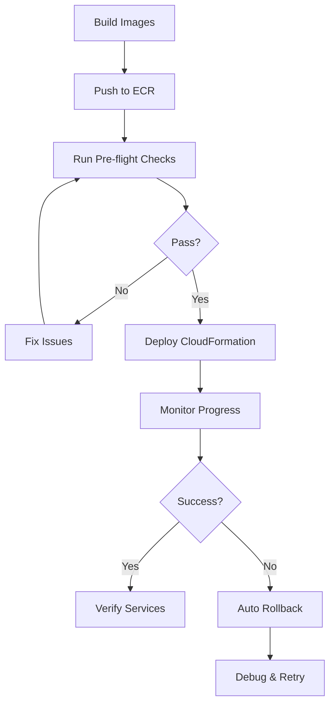

# AxonFlow Deployment Guide

**Last Updated:** November 19, 2025
**Version:** 1.0
**Applies to:** Staging and Production environments

---

## Table of Contents

1. [Overview](#overview)
2. [Prerequisites](#prerequisites)
3. [Account Architecture](#account-architecture)
4. [Deployment Workflow](#deployment-workflow)
5. [First-Time Deployment](#first-time-deployment)
6. [Updating Existing Deployment](#updating-existing-deployment)
7. [Monitoring Deployments](#monitoring-deployments)
8. [Rollback Procedures](#rollback-procedures)
9. [Troubleshooting](#troubleshooting)
10. [Best Practices](#best-practices)

---

## Overview

This guide covers the complete deployment process for AxonFlow using AWS CloudFormation, ECS Fargate, and ECR. The deployment system provides:

- **Zero-downtime deployments** - Rolling updates with circuit breakers
- **Automated validation** - Pre-flight checks catch issues before deployment
- **Self-healing** - Automatic rollback on health check failures
- **Multi-environment support** - Staging and production with separate configurations

### Key Components

- **CloudFormation Template**: `platform/aws-marketplace/cloudformation-ecs-fargate.yaml`
- **Parameter Files**: `config/cloudformation-params-{staging,production}.json`
- **Deployment Script**: `scripts/deploy-environment.sh`
- **Update Script**: `scripts/update-environment.sh`
- **Monitoring Script**: `scripts/monitor-deployment.sh`
- **Validation Library**: `scripts/lib/validate-aws-account.sh`

---

## Prerequisites

### Required Tools

```bash
# AWS CLI (v2 recommended)
aws --version  # Should be 2.x.x or higher

# jq for JSON processing
jq --version   # Should be 1.6 or higher

# Docker (for building images)
docker --version
```

### AWS Credentials

```bash
# Configure AWS credentials for internal account
aws configure --profile internal-production
# Account ID: 686831565523
# Region: eu-central-1

# Set as active profile
export AWS_PROFILE=internal-production
```

### Permissions Required

Your IAM user/role needs:
- CloudFormation: Full access
- ECS: Full access
- ECR: Full access
- RDS: Create/modify DB instances
- VPC: Read access
- IAM: Pass role (for ECS task execution)
- Secrets Manager: Read/write access

---

## Account Architecture

### Internal Account (686831565523)

**Purpose:** All staging and production deployments

**ECR Registry:** `686831565523.dkr.ecr.eu-central-1.amazonaws.com`

**Repositories:**
- `axonflow-agent`
- `axonflow-orchestrator`
- `axonflow-customer-portal`

**VPC Configuration:**
- VPC ID: `vpc-0bb3244ce543cf1c7`
- Public Subnets: `subnet-079b49b42e74e9c18`, `subnet-0bde2cd30f5ce7b68`
- Private Subnets: `subnet-06cf65ee07d9e764c`, `subnet-0ff06adbfb57f35d2`

### Marketplace Account (709825985650)

**Purpose:** AWS Marketplace testing ONLY (not covered in this guide)

**Important:** Never use marketplace account for staging/production!

---

## Deployment Workflow

### High-Level Process

```
1. Build Docker Images → 2. Push to ECR → 3. Run Pre-flight Checks → 4. Deploy/Update Stack → 5. Monitor → 6. Verify
```

### Detailed Flow



---

## First-Time Deployment

### Step 1: Build and Push Images

```bash
# From project root
cd /Users/saurabhjain/Development/axonflow-worktree-5

# Build all components (creates version tag from git commit)
./scripts/build-and-push.sh

# Note the version tag output (e.g., b237404)
```

### Step 2: Prepare Secrets

Generate or obtain:

**Database Password:**
- Minimum 16 characters
- Include uppercase, lowercase, numbers, special characters
- Example: `MySecure!Prod#DB2025`

**License Key:**
- Format: `AXON-{TIER}-{ORG}-{DATE}-{SIGNATURE}`
- Generate using: `./platform/agent/license/cmd/keygen/keygen`
- Example for staging: `AXON-PRO-staging-20251119-abc123def456`
- Example for production: `AXON-ENT-production-20251119-xyz789ghi012`

### Step 3: Deploy to Staging

```bash
# Deploy staging environment
./scripts/deploy-environment.sh staging b237404 \
  --db-password 'MySecure!Staging#DB2025' \
  --license-key 'AXON-PRO-staging-20251119-abc123def456'
```

**What happens:**
1. Loads validation library
2. Runs pre-flight checks (AWS account, ECR images, template validation)
3. Loads staging parameters from `config/cloudformation-params-staging.json`
4. Updates version tags to `b237404`
5. Injects DB password and license key
6. Creates CloudFormation stack with timestamp: `axonflow-staging-YYYYMMDD-HHMMSS`
7. Monitors deployment progress (polls every 30 seconds)
8. Shows deployment summary and next steps

**Expected Duration:** 15-30 minutes for first deployment

### Step 4: Verify Staging

```bash
# Stack should be saved to file
STACK_NAME=$(cat /Users/saurabhjain/Development/tmp/current-staging-stack.txt)

# Check stack status
aws cloudformation describe-stacks \
  --stack-name "$STACK_NAME" \
  --region eu-central-1 \
  --query 'Stacks[0].StackStatus'

# Get agent endpoint
AGENT_URL=$(aws cloudformation describe-stacks \
  --stack-name "$STACK_NAME" \
  --region eu-central-1 \
  --query 'Stacks[0].Outputs[?OutputKey==`AgentEndpoint`].OutputValue' \
  --output text)

# Test health endpoint
curl "$AGENT_URL/health"
# Expected: {"status":"healthy","version":"b237404"}

# Check ECS services
CLUSTER=$(aws cloudformation describe-stacks \
  --stack-name "$STACK_NAME" \
  --region eu-central-1 \
  --query 'Stacks[0].Outputs[?OutputKey==`ClusterName`].OutputValue' \
  --output text)

aws ecs describe-services \
  --cluster "$CLUSTER" \
  --services "${STACK_NAME}-agent-service" "${STACK_NAME}-orchestrator-service" \
  --region eu-central-1 \
  --query 'services[*].[serviceName,runningCount,desiredCount]'

# Check application logs
aws logs tail "/ecs/$STACK_NAME/agent" --follow --region eu-central-1
```

### Step 5: Deploy to Production

**Only after staging verification!**

```bash
# Deploy production environment
./scripts/deploy-environment.sh production b237404 \
  --db-password 'MySecure!Prod#DB2025' \
  --license-key 'AXON-ENT-production-20251119-xyz789ghi012'
```

**Production Differences:**
- Pricing Tier: `Enterprise` (vs Professional in staging)
- DB Instance: `db.t3.large` (vs db.t3.medium in staging)
- Agent Count: 3 instances (vs 2 in staging)
- Orchestrator Count: 4 instances (vs 2 in staging)
- Load Balancer: `internal` (vs internet-facing in staging)
- Monitoring: Prometheus + Grafana enabled (vs disabled in staging)

---

## Updating Existing Deployment

### When to Use Updates

Use the update script when you want to:
- Deploy a new version of AxonFlow components
- Change configuration (e.g., increase agent count)
- Update environment variables or secrets
- Modify infrastructure (e.g., add monitoring)

**Important:** Updates are zero-downtime with automatic rollback.

### Update Process

#### Step 1: Build New Version

```bash
# Make your code changes, commit, then build
git add .
git commit -m "Fix: resolve authentication timeout issue"
./scripts/build-and-push.sh

# Note the new version tag (e.g., c456789)
```

#### Step 2: Update Staging

```bash
# Update with new version (secrets optional - will use existing values)
./scripts/update-environment.sh staging c456789
```

**What happens:**
1. Runs pre-flight checks
2. Finds existing staging stack
3. Loads parameters and updates version tags
4. Creates CloudFormation changeset
5. Shows preview of changes
6. Asks for confirmation
7. Executes rolling update
8. Monitors progress
9. Verifies new version

**Key Feature:** The script shows you exactly what will change before applying:

```
━━━━━━━━━━━━━━━━━━━━━━━━━━━━━━━━━━━━━━━━━━━━━━━━━━━━━━━━━━━━━
📋 Changeset Preview
━━━━━━━━━━━━━━━━━━━━━━━━━━━━━━━━━━━━━━━━━━━━━━━━━━━━━━━━━━━━━

Action | Resource                  | Type
-------|---------------------------|-----------------------
Modify | AgentTaskDefinition       | AWS::ECS::TaskDefinition
Modify | OrchestratorTaskDefinition| AWS::ECS::TaskDefinition

⚠️  Review the changes above carefully

Execute this changeset? (yes/no):
```

#### Step 3: Verify Update

```bash
# The update script shows verification commands, or manually:
STACK_NAME=$(cat /Users/saurabhjain/Development/tmp/current-staging-stack.txt)

# Check that services are running new version
aws ecs describe-services \
  --cluster "${STACK_NAME}-cluster" \
  --services "${STACK_NAME}-agent-service" \
  --region eu-central-1 \
  --query 'services[0].deployments'

# Should show: runningCount increasing for new version, draining for old
```

#### Step 4: Update Production

```bash
# After staging verification
./scripts/update-environment.sh production c456789
```

### Rolling Update Behavior

CloudFormation performs updates with these settings:

- **MaximumPercent**: 200% - Can run 2x desired count during deployment
- **MinimumHealthyPercent**: 100% - Always keeps desired count running
- **DeploymentCircuitBreaker**: Enabled - Auto-rollback on health check failures

**Example:** For 3 agent instances:
1. Starts 3 new tasks (now running 6 total)
2. Waits for new tasks to pass health checks
3. Drains and stops 3 old tasks
4. Deployment complete (3 new tasks running)

If new tasks fail health checks:
- Circuit breaker triggers automatic rollback
- Old tasks remain running
- Stack returns to previous stable state

---

## Monitoring Deployments

### Using the Monitor Script

```bash
# Monitor any stack deployment
./scripts/monitor-deployment.sh axonflow-staging-20251119-143022
```

**Features:**
- Real-time status updates every 30 seconds
- Shows recent CloudFormation events
- Displays elapsed time
- On completion: Shows outputs, service health, next steps
- On failure: Shows error events and troubleshooting commands

**Example Output:**

```
━━━━━━━━━━━━━━━━━━━━━━━━━━━━━━━━━━━━━━━━━━━━━━━━━━━━━━━━━━━━━
📊 Monitoring CloudFormation Stack
━━━━━━━━━━━━━━━━━━━━━━━━━━━━━━━━━━━━━━━━━━━━━━━━━━━━━━━━━━━━━

  Stack: axonflow-staging-20251119-143022
  Region: eu-central-1
  Started: 2025-11-19 14:30:22 UTC

14:30:52 (0m30s) ⏳ CREATE_IN_PROGRESS

Recent Activity:
  AxonFlowVPC: CREATE_COMPLETE
  AgentSecurityGroup: CREATE_IN_PROGRESS
  DatabaseSubnetGroup: CREATE_IN_PROGRESS

14:31:22 (1m0s) ⏳ CREATE_IN_PROGRESS
...
```

### Manual Monitoring

```bash
# Check stack status
aws cloudformation describe-stacks \
  --stack-name <stack-name> \
  --region eu-central-1

# View stack events
aws cloudformation describe-stack-events \
  --stack-name <stack-name> \
  --region eu-central-1 \
  --max-items 20

# Check ECS service status
aws ecs describe-services \
  --cluster <cluster-name> \
  --services <service-name> \
  --region eu-central-1

# View container logs
aws logs tail /ecs/<stack-name>/agent --follow --region eu-central-1
```

---

## Rollback Procedures

### Automatic Rollback (Recommended)

The deployment system includes automatic rollback via DeploymentCircuitBreaker:

**Triggers:**
- New tasks fail health checks repeatedly
- Tasks crash during startup
- Tasks fail to start within grace period (600 seconds)

**Behavior:**
- New deployment stops
- Old tasks remain running
- Stack status: UPDATE_ROLLBACK_COMPLETE
- No action required from you

**Verify Rollback:**

```bash
# Check deployment events
aws ecs describe-services \
  --cluster <cluster-name> \
  --services <service-name> \
  --region eu-central-1 \
  --query 'services[0].events[0:5]'

# Look for: "service <name> has reached a steady state"
```

### Manual Rollback (Emergency)

If you need to force a rollback:

#### Option 1: Cancel Update In Progress

```bash
# Cancel ongoing update (triggers rollback)
aws cloudformation cancel-update-stack \
  --stack-name <stack-name> \
  --region eu-central-1
```

#### Option 2: Update to Previous Version

```bash
# Get previous version from git or deployment logs
PREVIOUS_VERSION="b237404"

# Deploy previous version
./scripts/update-environment.sh staging "$PREVIOUS_VERSION"
```

#### Option 3: Restore from Snapshot (Database)

If database migration causes issues:

```bash
# Find latest automated snapshot
aws rds describe-db-snapshots \
  --db-instance-identifier <db-identifier> \
  --region eu-central-1

# Restore to snapshot (requires downtime)
aws rds restore-db-instance-from-db-snapshot \
  --db-instance-identifier <new-identifier> \
  --db-snapshot-identifier <snapshot-id> \
  --region eu-central-1
```

---

## Troubleshooting

### Common Issues

#### Issue 1: Stack Creation Fails - ECR 403 Forbidden

**Symptoms:**
```
ResourceStatusReason: CannotPullContainerError: Error response from daemon:
pull access denied for 709825985650.dkr.ecr.eu-central-1.amazonaws.com/axonflow-agent
```

**Root Cause:** Deployed to wrong AWS account or used wrong ECR registry

**Fix:**
```bash
# Verify you're in correct account
aws sts get-caller-identity
# Should show: 686831565523 for staging/production

# Verify images exist in correct registry
aws ecr describe-images \
  --repository-name axonflow-agent \
  --region eu-central-1 \
  --image-ids imageTag=b237404

# If images in wrong account, rebuild and push to correct account
export AWS_PROFILE=internal-production
./scripts/build-and-push.sh
```

**Prevention:**
Always run pre-flight checks - they catch this!

```bash
./scripts/preflight-check.sh staging b237404
```

#### Issue 2: Stack Creation Fails - Service Not Stabilized

**Symptoms:**
```
ResourceStatusReason: Service NotStabilized failed to achieve stability
within timeout period
```

**Root Cause:** Health check grace period too short for database migrations

**Fix:**
Already fixed in latest template! HealthCheckGracePeriodSeconds = 600

If still occurring:
```bash
# Check migration logs
aws logs tail "/ecs/<stack-name>/agent" --region eu-central-1 | grep migration

# If migrations taking > 10 minutes, investigate DB performance
```

#### Issue 3: Database Connection Failures

**Symptoms:**
```
Error: connection refused or timeout connecting to database
```

**Possible Causes:**
1. Security group misconfiguration
2. Subnet routing issues
3. RDS instance not ready
4. Wrong database credentials

**Debug:**
```bash
# Check RDS status
aws rds describe-db-instances \
  --db-instance-identifier <db-identifier> \
  --region eu-central-1 \
  --query 'DBInstances[0].DBInstanceStatus'

# Should be: "available"

# Check security groups allow ECS → RDS
aws ec2 describe-security-groups \
  --group-ids <db-security-group> \
  --region eu-central-1 \
  --query 'SecurityGroups[0].IpPermissions'

# Should allow port 5432 from ECS security group
```

#### Issue 4: Out of Memory Errors

**Symptoms:**
```
Error: Container killed due to memory limit (exit code 137)
```

**Fix:**
Update task definition memory in parameters file:

```json
{
  "ParameterKey": "AgentMemory",
  "ParameterValue": "4096"  // Increase from 2048
}
```

Then update stack:
```bash
./scripts/update-environment.sh staging <version>
```

### Debug Checklist

When deployment fails:

- [ ] Check CloudFormation events for error details
- [ ] Verify AWS account (should be 686831565523 for staging/prod)
- [ ] Verify ECR images exist in correct registry
- [ ] Check CloudWatch logs for application errors
- [ ] Verify security group rules
- [ ] Check database instance status
- [ ] Verify secrets are correct (DB password, license key)
- [ ] Review task definition resource limits
- [ ] Check VPC and subnet configuration

---

## Best Practices

### Before Every Deployment

1. **Run pre-flight checks** - Catches 90% of issues
   ```bash
   ./scripts/preflight-check.sh <environment> <version>
   ```

2. **Test in staging first** - Never deploy directly to production

3. **Verify version tag** - Ensure you're deploying the right code
   ```bash
   git log -1 --oneline  # Should match your version tag
   ```

4. **Backup database** - Create manual snapshot before major changes
   ```bash
   aws rds create-db-snapshot \
     --db-instance-identifier <db-id> \
     --db-snapshot-identifier manual-backup-$(date +%Y%m%d-%H%M%S) \
     --region eu-central-1
   ```

### During Deployment

1. **Monitor actively** - Use monitor script or AWS console

2. **Watch for errors** - Check CloudWatch logs in real-time

3. **Don't interrupt** - Let CloudFormation complete or rollback

4. **Save stack names** - Scripts save to `/tmp/current-{env}-stack.txt`

### After Deployment

1. **Verify health endpoints** - Test all critical endpoints

2. **Check service metrics** - Ensure CPU/memory within limits

3. **Review logs** - Look for warnings or errors

4. **Test functionality** - Run smoke tests

5. **Document issues** - Update troubleshooting guide if new issues found

### Version Control

1. **Tag releases** - Create git tags for production deployments
   ```bash
   git tag -a v1.0.0 -m "Production release 2025-11-19"
   git push origin v1.0.0
   ```

2. **Document changes** - Update CHANGELOG.md

3. **Track deployments** - Record what version is in each environment

### Security

1. **Never commit secrets** - DB passwords, license keys, API keys

2. **Use AWS Secrets Manager** - For production secrets management

3. **Rotate credentials** - Regularly update DB passwords, API keys

4. **Review IAM policies** - Principle of least privilege

5. **Enable CloudTrail** - Audit all AWS API calls

### Cost Optimization

1. **Use appropriate instance sizes** - Don't over-provision

2. **Enable auto-scaling** - Scale down during low traffic

3. **Use Reserved Instances** - For production database (save 40-60%)

4. **Monitor costs** - Set up AWS Budgets alerts

5. **Clean up test stacks** - Delete old staging deployments

---

## Quick Reference

### Essential Commands

```bash
# Deploy new environment
./scripts/deploy-environment.sh <env> <version> --db-password <pass> --license-key <key>

# Update existing environment
./scripts/update-environment.sh <env> <version>

# Monitor deployment
./scripts/monitor-deployment.sh <stack-name>

# Pre-flight checks
./scripts/preflight-check.sh <env> <version>

# Build and push images
./scripts/build-and-push.sh

# Get stack outputs
aws cloudformation describe-stacks --stack-name <stack> --region eu-central-1

# Check service health
aws ecs describe-services --cluster <cluster> --services <service> --region eu-central-1

# View logs
aws logs tail /ecs/<stack-name>/agent --follow --region eu-central-1

# Delete stack
aws cloudformation delete-stack --stack-name <stack> --region eu-central-1
```

### File Locations

| File | Purpose |
|------|---------|
| `platform/aws-marketplace/cloudformation-ecs-fargate.yaml` | Main CloudFormation template |
| `config/cloudformation-params-staging.json` | Staging parameters |
| `config/cloudformation-params-production.json` | Production parameters |
| `scripts/deploy-environment.sh` | First-time deployment |
| `scripts/update-environment.sh` | Update existing stack |
| `scripts/monitor-deployment.sh` | Monitor progress |
| `scripts/lib/validate-aws-account.sh` | Account validation |
| `scripts/preflight-check.sh` | Pre-flight checks |

### Support

- **Technical Documentation:** `/technical-docs/`
- **Troubleshooting:** This guide, Troubleshooting section
- **AWS Support:** Contact via AWS console for infrastructure issues
- **AxonFlow Issues:** GitHub issues or internal ticketing system

---

**Document Version:** 1.0
**Last Updated:** November 19, 2025
**Next Review:** December 19, 2025
