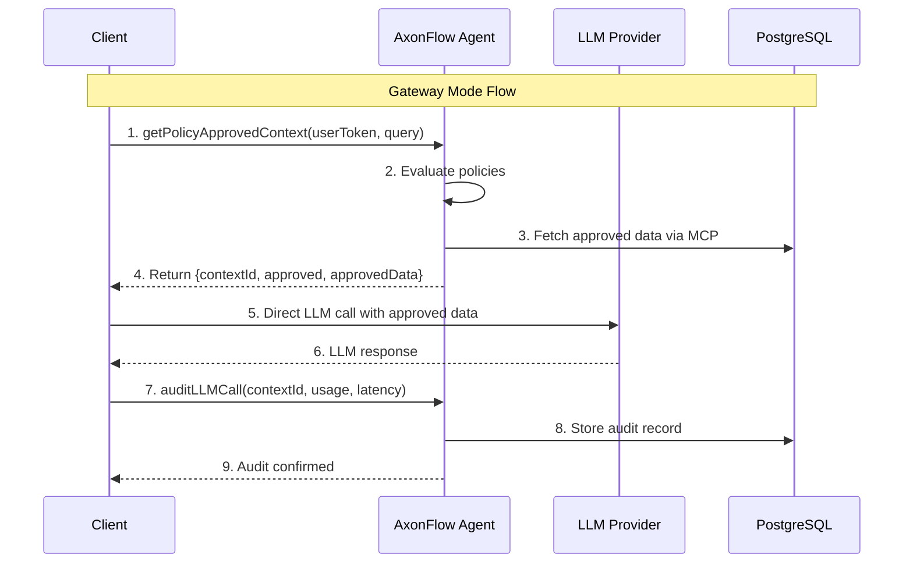

# Gateway Mode Migration Guide

This guide shows how to migrate from client-side policy enforcement (e.g., local `PolicyEngine`) to AxonFlow's Gateway Mode SDK.

## Architecture Overview



## Why Migrate?

**Before (Client-Side PolicyEngine):**
- Policy logic duplicated in each client
- Audit logs stored locally, not centralized
- No visibility into policy decisions across clients
- Policy updates require client deployments

**After (Gateway Mode SDK):**
- Centralized policy enforcement via AxonFlow
- Complete audit trail in AxonFlow database
- Real-time policy updates without client changes
- Cost tracking and analytics dashboard (Phase 3)

## Migration Steps

### Step 1: Install the SDK

**Go:**
```go
import "github.com/getaxonflow/axonflow-go"
```

**TypeScript:**
```bash
npm install @axonflow/sdk
```

### Step 2: Initialize the Client

**Before (Local Policy Engine):**
```go
policyEngine := NewPolicyEngine()
```

**After (Gateway Mode SDK):**
```go
axonflow := axonflow.NewClient(axonflow.AxonFlowConfig{
    AgentURL:     "https://your-axonflow-agent.com",
    ClientID:     "healthcare-demo",
    ClientSecret: os.Getenv("AXONFLOW_SECRET"),
    LicenseKey:   os.Getenv("AXONFLOW_LICENSE"),
})
```

### Step 3: Replace Policy Check with Pre-Check

**Before:**
```go
// Local policy evaluation
result := policyEngine.EvaluatePolicies(user, query)
if !result.Allowed {
    return fmt.Errorf("blocked: %s", result.BlockedBy)
}

// Make LLM call
response, _ := openai.Chat(query)
```

**After:**
```go
// Gateway Mode pre-check
ctx, err := axonflow.GetPolicyApprovedContext(
    userToken,
    []string{"postgres"},  // MCP connectors for data
    query,
    nil,  // additional context
)
if err != nil {
    return err
}
if !ctx.Approved {
    return fmt.Errorf("blocked: %s", ctx.BlockReason)
}

// Make LLM call with approved data
prompt := buildPrompt(ctx.ApprovedData)
response, _ := openai.Chat(prompt)
startTime := time.Now()
```

### Step 4: Add Audit Logging

**Before:**
```go
// Local audit logging
auditLog.Log(AuditEntry{
    UserID:    user.ID,
    Query:     query,
    Response:  response,
    Timestamp: time.Now(),
})
```

**After:**
```go
// Report to AxonFlow for centralized audit
latencyMs := time.Since(startTime).Milliseconds()
_, err = axonflow.AuditLLMCall(
    ctx.ContextID,
    summarizeResponse(response),
    "openai",
    "gpt-4",
    axonflow.TokenUsage{
        PromptTokens:     response.Usage.PromptTokens,
        CompletionTokens: response.Usage.CompletionTokens,
        TotalTokens:      response.Usage.TotalTokens,
    },
    latencyMs,
    map[string]interface{}{
        "user_id":    user.ID,
        "session_id": sessionID,
    },
)
```

### Step 5: Remove Client-Side Policy Engine

After migrating to Gateway Mode, you can remove:
- `policy_engine.go` - Policy evaluation logic
- `policy_defaults.go` - Default policy rules
- Local audit logging code

The Agent will handle all policy enforcement and audit logging.

## Complete Example

### Healthcare Demo (TypeScript)

```typescript
import { AxonFlow } from '@axonflow/sdk';

const axonflow = new AxonFlow({
  apiKey: process.env.AXONFLOW_LICENSE,
  endpoint: process.env.AXONFLOW_AGENT_URL,
  tenant: 'healthcare-demo'
});

async function handlePatientQuery(userToken: string, query: string) {
  // Step 1: Pre-check with AxonFlow
  const ctx = await axonflow.getPolicyApprovedContext({
    userToken,
    dataSources: ['postgres'],
    query
  });

  if (!ctx.approved) {
    throw new Error(`Query blocked: ${ctx.blockReason}`);
  }

  // Step 2: Make LLM call with approved data
  const startTime = Date.now();
  const response = await openai.chat.completions.create({
    model: 'gpt-4',
    messages: [
      { role: 'system', content: 'You are a healthcare assistant...' },
      { role: 'user', content: buildPrompt(ctx.approvedData, query) }
    ]
  });
  const latencyMs = Date.now() - startTime;

  // Step 3: Audit the call
  await axonflow.auditLLMCall(
    ctx.contextId,
    response.choices[0].message.content.substring(0, 100),
    'openai',
    'gpt-4',
    {
      promptTokens: response.usage.prompt_tokens,
      completionTokens: response.usage.completion_tokens,
      totalTokens: response.usage.total_tokens
    },
    latencyMs
  );

  return response.choices[0].message.content;
}
```

## Benefits After Migration

| Aspect | Before | After |
|--------|--------|-------|
| Policy Updates | Deploy new client code | Update in AxonFlow Agent |
| Audit Trail | Scattered across clients | Centralized in AxonFlow |
| Cost Tracking | Manual | Automatic (Phase 3) |
| Compliance | Per-client implementation | Standardized via AxonFlow |
| Latency | Local policy: ~1ms | AxonFlow: <10ms P95 |

## Troubleshooting

### Pre-check Returns Empty ApprovedData
- Check that `dataSources` includes the correct MCP connector names
- Verify MCP connectors are configured in AxonFlow Agent
- Check user has permission for the requested data sources

### Context Expired Error on Audit
- Context IDs expire after 5 minutes
- Make LLM call and audit within the expiry window
- If longer processing needed, re-check with `getPolicyApprovedContext()`

### Policy Blocking Legitimate Requests
- Review policies in AxonFlow Agent
- Check query patterns against SQL injection rules
- Verify user roles and permissions

## Next Steps

1. **Phase 0 & 1 Complete**: Gateway Mode SDK available (PR #153, #155)
2. **Phase 2 (Planned)**: Update demo clients to use Gateway Mode
3. **Phase 3 (Planned)**: Proxy Mode enhancement with response filtering
4. **Phase 4 (Planned)**: AuditQueue integration for resilient audit logging

See `axonflow-business-docs/roadmap/GATEWAY_MODE_ROADMAP.md` for full roadmap.
