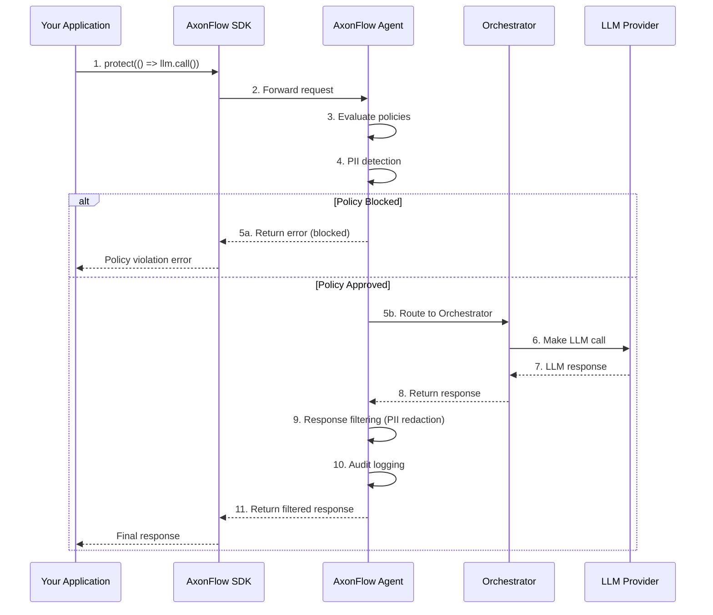
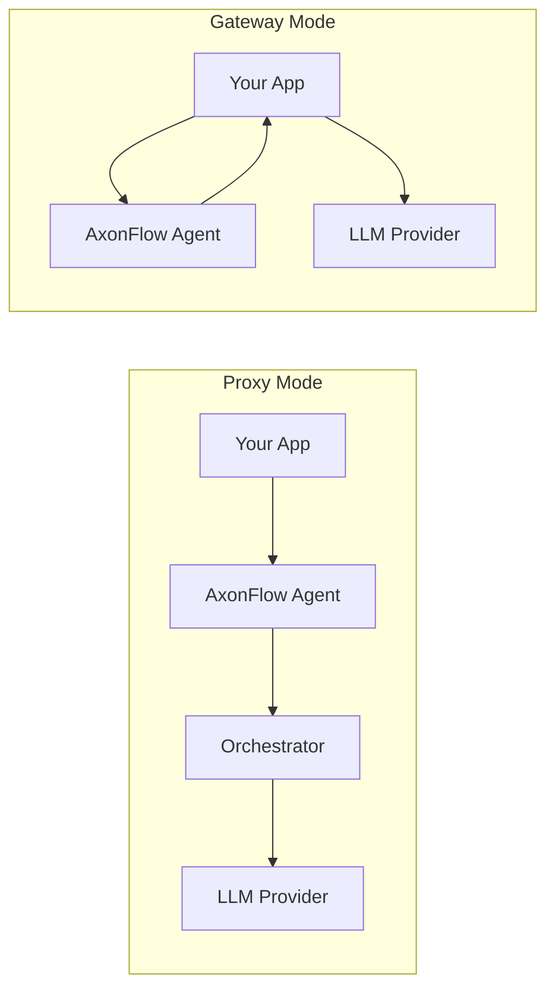
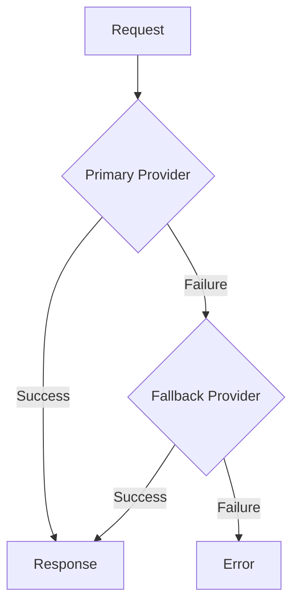
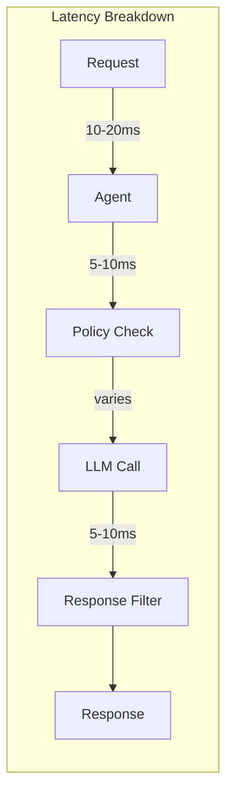

# Proxy Mode Guide

Proxy Mode is the simplest way to add governance to your AI applications. AxonFlow acts as a proxy between your application and LLM providers, handling policy enforcement, PII detection, rate limiting, and audit logging automatically.

## How It Works



**Key Points:**
- Your app never talks to LLM providers directly
- All requests flow through AxonFlow Agent → Orchestrator → LLM
- Response filtering happens before data reaches your app
- Audit logging is 100% automatic

## Quick Start

### TypeScript

```typescript
import { AxonFlow } from '@axonflow/sdk';
import OpenAI from 'openai';

const openai = new OpenAI({ apiKey: process.env.OPENAI_API_KEY });
const axonflow = new AxonFlow({
  endpoint: process.env.AXONFLOW_AGENT_URL,
  clientId: process.env.AXONFLOW_CLIENT_ID,
  clientSecret: process.env.AXONFLOW_CLIENT_SECRET
});

// Wrap any AI call with protect()
const response = await axonflow.protect(async () => {
  return openai.chat.completions.create({
    model: 'gpt-4',
    messages: [{ role: 'user', content: 'Analyze this data...' }]
  });
});
```

### Go

```go
import "github.com/getaxonflow/axonflow-sdk-go"

client := axonflow.NewClient(axonflow.AxonFlowConfig{
    AgentURL:     os.Getenv("AXONFLOW_AGENT_URL"),
    ClientID:     os.Getenv("AXONFLOW_CLIENT_ID"),
    ClientSecret: os.Getenv("AXONFLOW_CLIENT_SECRET"),
})

// Execute governed query
resp, err := client.ExecuteQuery(
    userToken,
    "Analyze this data...",
    "chat",
    nil,
)
```

### Python

```python
from axonflow import AxonFlow

async with AxonFlow(
    agent_url=os.environ["AXONFLOW_AGENT_URL"],
    client_id=os.environ["AXONFLOW_CLIENT_ID"],
    client_secret=os.environ["AXONFLOW_CLIENT_SECRET"]
) as client:
    response = await client.execute_query(
        user_token="user-jwt",
        query="Analyze this data...",
        request_type="chat"
    )
```

## When to Use Proxy Mode

### Ideal Use Cases

| Scenario | Why Proxy Mode |
|----------|----------------|
| **Greenfield projects** | Start with governance from day one |
| **Customer support chatbot** | Simple integration, automatic audit trail |
| **Compliance-heavy industries** | 100% automatic audit coverage for HIPAA, SOX, PCI |
| **Response filtering needed** | Automatic PII detection and redaction |
| **Internal Q&A assistant** | Zero-code governance |

### Architecture Comparison



## Features

### 1. Automatic Policy Enforcement

All requests are checked against your policies before reaching the LLM:

```typescript
try {
  const response = await axonflow.protect(async () => {
    return openai.chat.completions.create({
      model: 'gpt-4',
      messages: [{ role: 'user', content: 'My SSN is 123-45-6789' }]
    });
  });
} catch (error) {
  // error.message: "Request blocked by AxonFlow: PII detected"
}
```

### 2. Automatic Audit Logging

Every request is logged for compliance - no additional code needed:

```typescript
const response = await axonflow.protect(async () => {
  return openai.chat.completions.create({ ... });
});

// Audit automatically includes:
// - Timestamp
// - User token
// - Request content (sanitized)
// - Response summary
// - Policies evaluated
// - Token usage
// - Latency metrics
```

### 3. Response Filtering (Enterprise)

PII in responses is automatically redacted:

```typescript
const response = await axonflow.protect(async () => {
  return openai.chat.completions.create({
    model: 'gpt-4',
    messages: [{ role: 'user', content: "What is John Smith's email?" }]
  });
});

// Response: "The customer's email is [EMAIL REDACTED]"
```

### 4. Rate Limiting

Automatic rate limiting per user/tenant:

```typescript
try {
  const response = await axonflow.protect(async () => {
    return openai.chat.completions.create({ ... });
  });
} catch (error) {
  if (error.code === 'RATE_LIMIT_EXCEEDED') {
    // Wait and retry
    console.log(`Retry after: ${error.retryAfter}ms`);
  }
}
```

### 5. LLM Provider Failover

Orchestrator automatically handles provider failover:



## Latency Considerations

Proxy Mode adds latency because requests route through AxonFlow:

| Deployment | Additional Latency | Total Overhead |
|------------|-------------------|----------------|
| Public endpoint | ~50-100ms | Higher |
| VPC endpoint | ~10-20ms | Lower |
| Same-region | ~5-15ms | Minimal |



For latency-sensitive applications, consider [Gateway Mode](./GATEWAY_MODE_MIGRATION_GUIDE.md).

## Error Handling

```typescript
try {
  const response = await axonflow.protect(async () => {
    return openai.chat.completions.create({ ... });
  });
  console.log('Success:', response);
} catch (error) {
  switch (error.code) {
    case 'POLICY_VIOLATION':
      console.log('Policy violation:', error.message);
      break;
    case 'RATE_LIMIT_EXCEEDED':
      console.log('Rate limited, retry after:', error.retryAfter);
      break;
    case 'PII_DETECTED':
      console.log('PII detected in request');
      break;
    default:
      console.error('Error:', error);
  }
}
```

## Configuration

```typescript
const axonflow = new AxonFlow({
  endpoint: process.env.AXONFLOW_AGENT_URL,
  clientId: process.env.AXONFLOW_CLIENT_ID,
  clientSecret: process.env.AXONFLOW_CLIENT_SECRET,
  timeout: 30000,            // Request timeout in ms
  retry: {
    enabled: true,
    maxAttempts: 3,
    delay: 1000
  }
});
```

## Comparison with Gateway Mode

| Feature | Proxy Mode | Gateway Mode |
|---------|------------|--------------|
| Integration Effort | Minimal | Moderate |
| Code Changes | Wrap existing calls | Pre-check + Audit |
| Latency Overhead | Higher (~50-100ms) | Lower (~10-20ms) |
| Response Filtering | Yes | No |
| Audit Coverage | 100% automatic | Manual (call audit API) |
| LLM Control | Limited (AxonFlow routes) | Full (you choose) |
| Best For | Simple apps, compliance | Frameworks, performance |

## Next Steps

- [Choosing a Mode](./CHOOSING_A_MODE.md) - Decision guide for Proxy vs Gateway
- [Gateway Mode Migration Guide](./GATEWAY_MODE_MIGRATION_GUIDE.md) - For lowest latency
- [PII Detection](./PII_DETECTION.md) - Configure PII patterns
