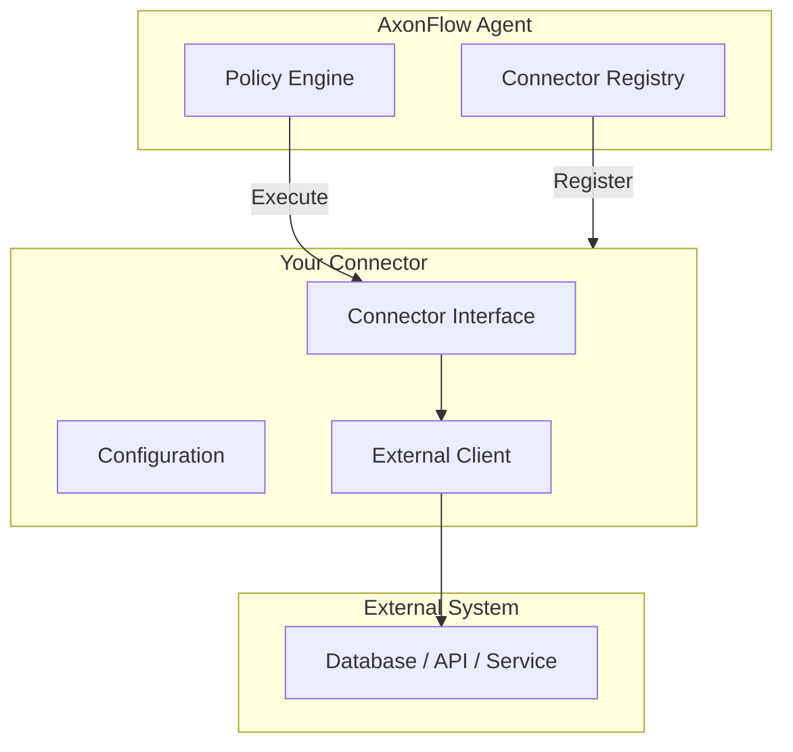

# MCP Connector Development Guide

**Version:** 1.0
**Created:** December 6, 2025
**Purpose:** How to create new MCP connectors for AxonFlow

---

## Overview

MCP (Model Context Protocol) connectors allow AxonFlow to integrate with external data sources and APIs. This guide shows you how to create a new connector.

---

## Connector Architecture



---

## Quick Start (New Connector)

### Step 1: Create Connector Directory

```bash
mkdir -p platform/connectors/myconnector
```

### Step 2: Implement Connector Interface

Create `platform/connectors/myconnector/connector.go`:

```go
package myconnector

import (
    "context"
    "encoding/json"

    "github.com/getaxonflow/axonflow/platform/connectors"
)

// Connector implements the MCP connector interface
type Connector struct {
    config *Config
    client *Client
}

// Config holds connector configuration
type Config struct {
    Host     string `json:"host"`
    Port     int    `json:"port"`
    APIKey   string `json:"api_key"`
    Timeout  int    `json:"timeout_seconds"`
}

// New creates a new connector instance
func New(configJSON json.RawMessage) (connectors.Connector, error) {
    var config Config
    if err := json.Unmarshal(configJSON, &config); err != nil {
        return nil, err
    }

    client, err := NewClient(config)
    if err != nil {
        return nil, err
    }

    return &Connector{
        config: &config,
        client: client,
    }, nil
}

// Name returns the connector name
func (c *Connector) Name() string {
    return "myconnector"
}

// Type returns the connector type
func (c *Connector) Type() string {
    return "api" // or "database", "messaging", etc.
}

// ExecuteResource handles read operations (MCP Resources)
func (c *Connector) ExecuteResource(ctx context.Context, req *connectors.ResourceRequest) (*connectors.ResourceResponse, error) {
    switch req.Operation {
    case "list_items":
        return c.listItems(ctx, req)
    case "get_item":
        return c.getItem(ctx, req)
    default:
        return nil, connectors.ErrUnsupportedOperation
    }
}

// ExecuteTool handles write operations (MCP Tools)
func (c *Connector) ExecuteTool(ctx context.Context, req *connectors.ToolRequest) (*connectors.ToolResponse, error) {
    switch req.Operation {
    case "create_item":
        return c.createItem(ctx, req)
    case "update_item":
        return c.updateItem(ctx, req)
    case "delete_item":
        return c.deleteItem(ctx, req)
    default:
        return nil, connectors.ErrUnsupportedOperation
    }
}

// Close cleans up resources
func (c *Connector) Close() error {
    return c.client.Close()
}

// Health returns connector health status
func (c *Connector) Health(ctx context.Context) error {
    return c.client.Ping(ctx)
}
```

### Step 3: Implement Operations

```go
// listItems implements the list_items operation
func (c *Connector) listItems(ctx context.Context, req *connectors.ResourceRequest) (*connectors.ResourceResponse, error) {
    // Extract parameters
    limit := req.GetInt("limit", 10)
    offset := req.GetInt("offset", 0)

    // Call external API
    items, err := c.client.ListItems(ctx, limit, offset)
    if err != nil {
        return nil, err
    }

    // Return response
    return &connectors.ResourceResponse{
        Data:    items,
        Count:   len(items),
        HasMore: len(items) == limit,
    }, nil
}

// getItem implements the get_item operation
func (c *Connector) getItem(ctx context.Context, req *connectors.ResourceRequest) (*connectors.ResourceResponse, error) {
    id := req.GetString("id", "")
    if id == "" {
        return nil, connectors.ErrMissingParameter("id")
    }

    item, err := c.client.GetItem(ctx, id)
    if err != nil {
        return nil, err
    }

    return &connectors.ResourceResponse{
        Data: item,
    }, nil
}

// createItem implements the create_item operation
func (c *Connector) createItem(ctx context.Context, req *connectors.ToolRequest) (*connectors.ToolResponse, error) {
    var item Item
    if err := req.UnmarshalParams(&item); err != nil {
        return nil, err
    }

    created, err := c.client.CreateItem(ctx, &item)
    if err != nil {
        return nil, err
    }

    return &connectors.ToolResponse{
        Success: true,
        Data:    created,
    }, nil
}
```

### Step 4: Register Connector

Edit `platform/connectors/registry.go`:

```go
import "github.com/getaxonflow/axonflow/platform/connectors/myconnector"

func init() {
    Register("myconnector", myconnector.New)
}
```

### Step 5: Add Tests

Create `platform/connectors/myconnector/connector_test.go`:

```go
package myconnector

import (
    "context"
    "testing"

    "github.com/stretchr/testify/assert"
    "github.com/stretchr/testify/require"
)

func TestNew(t *testing.T) {
    config := `{"host": "localhost", "port": 8080}`
    conn, err := New([]byte(config))
    require.NoError(t, err)
    assert.Equal(t, "myconnector", conn.Name())
}

func TestListItems(t *testing.T) {
    // Setup mock server
    // Test implementation
}
```

---

## Connector Interface

### Required Methods

| Method | Description | When Called |
|--------|-------------|-------------|
| `Name() string` | Connector identifier | Registration |
| `Type() string` | Connector category | Logging/metrics |
| `ExecuteResource()` | Read operations | MCP Resources endpoint |
| `ExecuteTool()` | Write operations | MCP Tools endpoint |
| `Close() error` | Cleanup | Shutdown |
| `Health() error` | Health check | /health endpoint |

### Optional Methods

| Method | Description |
|--------|-------------|
| `OnConnect()` | Called after successful connection |
| `OnDisconnect()` | Called before disconnection |
| `Metrics()` | Return Prometheus metrics |

---

## Configuration

### Environment Variables

```bash
# Connector-specific config via env
AXONFLOW_CONNECTOR_MYCONNECTOR_HOST=api.example.com
AXONFLOW_CONNECTOR_MYCONNECTOR_API_KEY=secret123
```

### YAML Config

```yaml
# config/connectors.yaml
myconnector:
  host: api.example.com
  port: 443
  api_key: ${MYCONNECTOR_API_KEY}
  timeout_seconds: 30
  max_retries: 3
```

### Secrets Manager

```go
func (c *Connector) loadCredentials(ctx context.Context) error {
    // Load from AWS Secrets Manager
    secret, err := secretsmanager.GetSecret(ctx, "axonflow/connectors/myconnector")
    if err != nil {
        return err
    }
    c.config.APIKey = secret.APIKey
    return nil
}
```

---

## Error Handling

### Standard Errors

```go
var (
    ErrConnectionFailed    = errors.New("connection failed")
    ErrAuthenticationFailed = errors.New("authentication failed")
    ErrRateLimited         = errors.New("rate limited")
    ErrTimeout             = errors.New("operation timeout")
    ErrNotFound            = errors.New("resource not found")
)
```

### Error Wrapping

```go
func (c *Connector) getItem(ctx context.Context, id string) (*Item, error) {
    item, err := c.client.Get(ctx, id)
    if err != nil {
        if errors.Is(err, client.ErrNotFound) {
            return nil, connectors.ErrNotFound
        }
        return nil, fmt.Errorf("get item %s: %w", id, err)
    }
    return item, nil
}
```

---

## Best Practices

### 1. Connection Pooling

```go
type Connector struct {
    pool *ConnectionPool
}

func New(config json.RawMessage) (connectors.Connector, error) {
    pool := NewConnectionPool(
        MaxConnections: 25,
        IdleTimeout:    5 * time.Minute,
    )
    return &Connector{pool: pool}, nil
}
```

### 2. Retry Logic

```go
func (c *Connector) executeWithRetry(ctx context.Context, fn func() error) error {
    return retry.Do(
        fn,
        retry.Attempts(3),
        retry.Delay(100*time.Millisecond),
        retry.MaxDelay(2*time.Second),
        retry.OnRetry(func(n uint, err error) {
            log.Printf("Retry %d: %v", n, err)
        }),
    )
}
```

### 3. Timeout Handling

```go
func (c *Connector) ExecuteResource(ctx context.Context, req *connectors.ResourceRequest) (*connectors.ResourceResponse, error) {
    ctx, cancel := context.WithTimeout(ctx, c.config.Timeout)
    defer cancel()

    return c.doExecute(ctx, req)
}
```

### 4. Metrics

```go
var (
    requestsTotal = promauto.NewCounterVec(
        prometheus.CounterOpts{
            Name: "axonflow_connector_requests_total",
            Help: "Total connector requests",
        },
        []string{"connector", "operation", "status"},
    )

    requestDuration = promauto.NewHistogramVec(
        prometheus.HistogramOpts{
            Name:    "axonflow_connector_request_duration_seconds",
            Help:    "Request duration",
            Buckets: prometheus.DefBuckets,
        },
        []string{"connector", "operation"},
    )
)
```

---

## Testing

### Unit Tests

```go
func TestConnector_ExecuteResource(t *testing.T) {
    // Create connector with mock client
    conn := &Connector{
        client: &MockClient{
            items: []Item{{ID: "1", Name: "Test"}},
        },
    }

    req := &connectors.ResourceRequest{
        Operation: "list_items",
        Parameters: map[string]interface{}{
            "limit": 10,
        },
    }

    resp, err := conn.ExecuteResource(context.Background(), req)
    require.NoError(t, err)
    assert.Equal(t, 1, resp.Count)
}
```

### Integration Tests

```go
//go:build integration

func TestConnector_Integration(t *testing.T) {
    config := os.Getenv("MYCONNECTOR_TEST_CONFIG")
    if config == "" {
        t.Skip("MYCONNECTOR_TEST_CONFIG not set")
    }

    conn, err := New([]byte(config))
    require.NoError(t, err)
    defer conn.Close()

    // Test actual operations
}
```

---

## Existing Connectors (Reference)

| Connector | Type | Directory | Good Example For |
|-----------|------|-----------|------------------|
| `postgres` | Database | `connectors/postgres/` | SQL queries, RLS |
| `redis` | Cache | `connectors/redis/` | Simple ops |
| `http` | API | `connectors/http/` | REST calls |
| `amadeus` | Travel API | `ee/connectors/amadeus/` | OAuth, complex API |
| `salesforce` | CRM | `ee/connectors/salesforce/` | Enterprise auth |

---

## Checklist

Before submitting your connector:

- [ ] Implements all required interface methods
- [ ] Has comprehensive unit tests (70%+ coverage)
- [ ] Has integration tests
- [ ] Handles errors properly
- [ ] Has connection pooling (if applicable)
- [ ] Has retry logic
- [ ] Has proper timeout handling
- [ ] Exposes Prometheus metrics
- [ ] Documented in MCP_CONNECTORS.md
- [ ] Registered in connector registry

---

## Connector SDK

The AxonFlow Connector SDK (`platform/connectors/sdk`) provides production-ready utilities:

### Authentication Providers

```go
import "axonflow/platform/connectors/sdk"

// API Key, Basic, Bearer, OAuth 2.0, AWS IAM Signature V4
auth := sdk.NewAPIKeyAuth("key", "X-API-Key", sdk.APIKeyHeader)
auth := sdk.NewOAuthAuth(tokenURL, clientID, clientSecret, scopes)
auth := sdk.NewIAMAuth(accessKey, secretKey, region, service)
```

### Rate Limiting

```go
// Token bucket rate limiter
limiter := sdk.NewRateLimiter(100, 100) // 100 requests/sec
limiter.Wait(ctx)

// Adaptive rate limiter (reads X-RateLimit headers)
adaptive := sdk.NewAdaptiveRateLimiter(100, 100)

// Multi-tenant rate limiting
mtLimiter := sdk.NewMultiTenantRateLimiter(...)
mtLimiter.Wait(ctx, tenantID)
```

### Retry with Circuit Breaker

```go
// Retry with exponential backoff
result, err := sdk.RetryWithBackoff(ctx, sdk.DefaultRetryConfig(), fn)

// Circuit breaker pattern
cb := sdk.NewCircuitBreaker(5, 30*time.Second)
if cb.Allow() {
    if err := doSomething(); err != nil {
        cb.RecordFailure()
    } else {
        cb.RecordSuccess()
    }
}
```

### Metrics Collection

```go
metrics := sdk.NewConnectorMetrics("myconnector")
metrics.RecordQuery(latency)
metrics.RecordQueryError()

// Prometheus export
exporter := sdk.NewPrometheusExporter()
exporter.RegisterConnector("myconnector", metrics)
```

### Testing Framework

```go
// Mock connector
mock := sdk.NewMockConnector()
mock.SetQueryResult(&base.QueryResult{...})

// Test harness
harness := sdk.NewTestHarness(connector)
harness.TestConnection(t, config)
harness.TestQuery(t, query)

// Benchmarks
bench := sdk.NewBenchmarkHarness(connector)
bench.BenchmarkQuery(b, query)
```

Full SDK documentation: [platform/connectors/sdk/README.md](../platform/connectors/sdk/README.md)

---

## Related Documentation

- [MCP Connectors](/docs/mcp/) - Available connectors and configuration
- [MCP Policy Enforcement](/docs/mcp/policy-enforcement/) - Policy enforcement for connector operations
- [Connector SDK README](../platform/connectors/sdk/README.md) - SDK utilities

---

**Last Updated:** December 7, 2025
