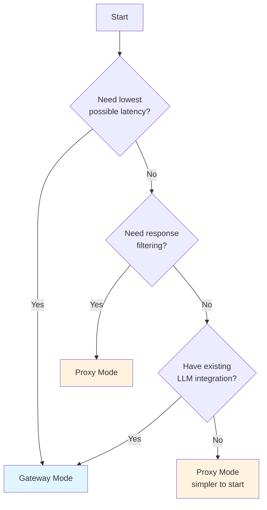
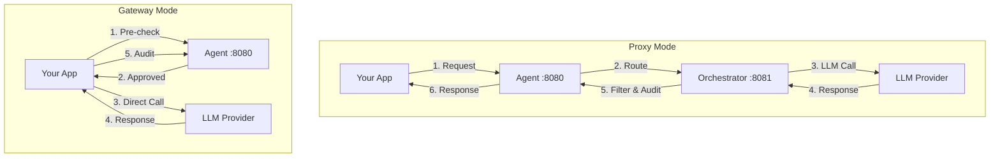
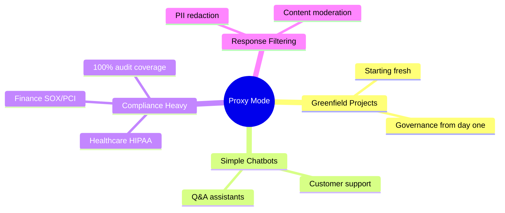
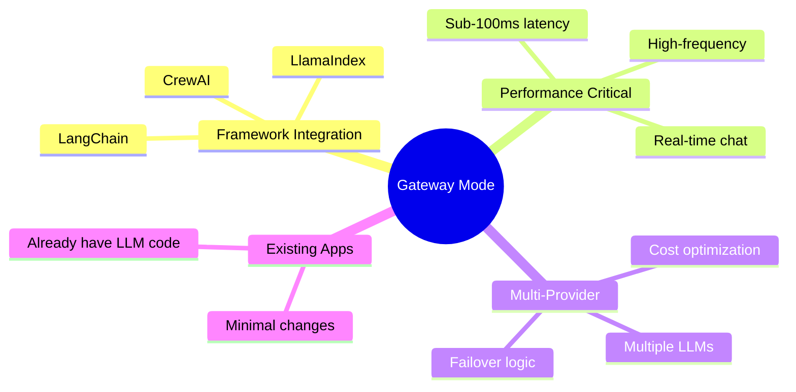
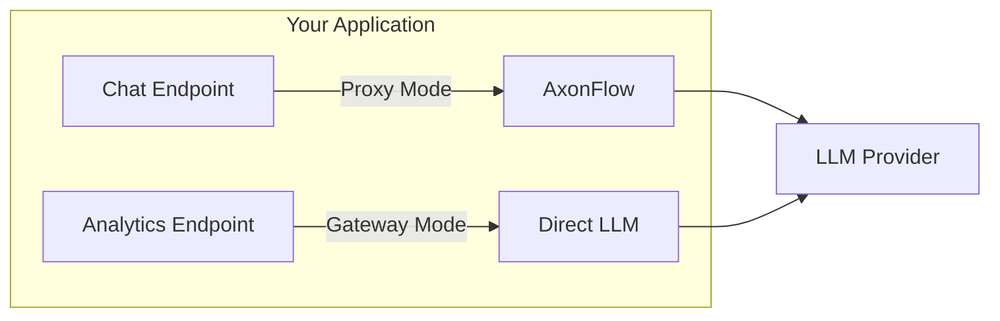

# Choosing Between Proxy Mode and Gateway Mode

AxonFlow offers two integration modes to fit different requirements. This guide helps you choose the right one for your application.

## Quick Decision Guide



## Architecture Overview



**Key Difference:**
- **Proxy Mode**: AxonFlow sits between you and the LLM (full proxy)
- **Gateway Mode**: AxonFlow validates before/after, you call LLM directly

## Feature Comparison

| Feature | Proxy Mode | Gateway Mode |
|---------|------------|--------------|
| **Integration** | | |
| Code changes required | Minimal (wrap calls) | Moderate (pre-check + audit) |
| Learning curve | Low | Medium |
| Framework support | Good | Best (LangChain, LlamaIndex) |
| **Performance** | | |
| Latency overhead | ~50-100ms (public) / ~10-20ms (VPC) | ~10-20ms |
| Request flow | App → AxonFlow → LLM | App → LLM (direct) |
| **Features** | | |
| Policy enforcement | Automatic | Automatic (pre-check) |
| Audit logging | 100% automatic | Manual (call audit API) |
| Response filtering | Yes (PII redaction) | No |
| Rate limiting | Automatic | Automatic (pre-check) |
| **Control** | | |
| LLM provider | AxonFlow routes | You choose |
| Model selection | Limited | Full control |
| Request modification | Limited | Full control |

## When to Choose Proxy Mode

### Ideal Use Cases



### Code Example

```typescript
// Proxy Mode - Simple, automatic governance
const response = await axonflow.protect(async () => {
  return openai.chat.completions.create({
    model: 'gpt-4',
    messages: [{ role: 'user', content: prompt }]
  });
});
// That's it! Policy, audit, filtering all handled automatically
```

## When to Choose Gateway Mode

### Ideal Use Cases



### Code Example

```typescript
// Gateway Mode - Full control, lowest latency

// 1. Pre-check (10-20ms)
const ctx = await axonflow.getPolicyApprovedContext({
  userToken: token,
  query: prompt,
  dataSources: ['postgres']
});

if (!ctx.approved) throw new Error(ctx.blockReason);

// 2. Direct LLM call (you control everything)
const response = await openai.chat.completions.create({
  model: 'gpt-4',
  messages: [{ role: 'user', content: prompt }]
});

// 3. Audit (async, non-blocking)
await axonflow.auditLLMCall({
  contextId: ctx.contextId,
  responseSummary: response.choices[0].message.content?.substring(0, 100),
  provider: 'openai',
  model: 'gpt-4',
  tokenUsage: response.usage,
  latencyMs
});
```

## Latency Comparison

```mermaid
gantt
    title Request Latency Breakdown
    dateFormat X
    axisFormat %L ms

    section Proxy Mode
    Agent Processing     :0, 20
    Orchestrator        :20, 30
    LLM Call            :30, 530
    Response Filter     :530, 540
    Total: ~540ms       :milestone, 540, 0

    section Gateway Mode
    Pre-check           :0, 15
    Direct LLM Call     :15, 515
    Audit (async)       :515, 515
    Total: ~515ms       :milestone, 515, 0
```



**Overhead Comparison:**

| Mode | AxonFlow Overhead | Notes |
|------|-------------------|-------|
| Proxy (Public) | +50-100ms | Includes response filtering |
| Proxy (VPC) | +10-20ms | Same-region deployment |
| Gateway | +10-20ms | Pre-check only, audit is async |

## Decision Matrix

| Requirement | Recommended Mode |
|-------------|------------------|
| Fastest integration | Proxy |
| Lowest latency | Gateway |
| Response filtering (PII redaction) | Proxy |
| Framework integration (LangChain) | Gateway |
| 100% automatic audit | Proxy |
| Multi-provider routing | Gateway |
| Compliance reporting | Either |
| Existing LLM code | Gateway |
| New project | Proxy (start simple) |

## Migration Paths

### Proxy → Gateway

If you start with Proxy Mode and need lower latency later:

```typescript
// Before: Proxy Mode
const response = await axonflow.protect(async () => {
  return openai.chat.completions.create({ ... });
});

// After: Gateway Mode
const ctx = await axonflow.getPolicyApprovedContext({ ... });
const response = await openai.chat.completions.create({ ... });
await axonflow.auditLLMCall({ contextId: ctx.contextId, ... });
```

### Gateway → Proxy

If you want simpler code with automatic features:

```typescript
// Before: Gateway Mode
const ctx = await axonflow.getPolicyApprovedContext({ ... });
const response = await openai.chat.completions.create({ ... });
await axonflow.auditLLMCall({ ... });

// After: Proxy Mode
const response = await axonflow.protect(async () => {
  return openai.chat.completions.create({ ... });
});
```

## Hybrid Approach

You can use both modes in the same application:



```typescript
// Use Proxy Mode for simple chat (automatic everything)
app.post('/api/chat', async (req, res) => {
  const response = await axonflow.protect(async () => {
    return openai.chat.completions.create({
      model: 'gpt-3.5-turbo',
      messages: [{ role: 'user', content: req.body.prompt }]
    });
  });
  res.json(response);
});

// Use Gateway Mode for performance-critical analytics
app.post('/api/analyze', async (req, res) => {
  const ctx = await axonflow.getPolicyApprovedContext({
    userToken: req.headers.authorization,
    query: req.body.query,
    dataSources: ['postgres', 'snowflake']
  });

  if (!ctx.approved) {
    return res.status(403).json({ error: ctx.blockReason });
  }

  // Direct LLM call for lowest latency
  const response = await openai.chat.completions.create({ ... });

  // Fire-and-forget audit (non-blocking)
  axonflow.auditLLMCall({ contextId: ctx.contextId, ... }).catch(console.error);

  res.json(response);
});
```

## Summary

| Start With | If You Need |
|------------|-------------|
| **Proxy Mode** | Simplicity, automatic audit, response filtering, compliance |
| **Gateway Mode** | Lowest latency, full LLM control, framework integration |

**Recommendation:**
- **New projects**: Start with Proxy Mode for simplicity
- **Existing LLM code**: Use Gateway Mode for minimal changes
- **Performance critical**: Gateway Mode
- **Compliance critical**: Proxy Mode (100% automatic audit)

## Next Steps

- [Proxy Mode Guide](./proxy-mode.md) - Deep dive into Proxy Mode
- [Gateway Mode Migration Guide](./gateway-mode.md) - Deep dive into Gateway Mode
- [SDK Comparison](../reference/sdk-comparison.md) - TypeScript vs Go vs Python SDKs
