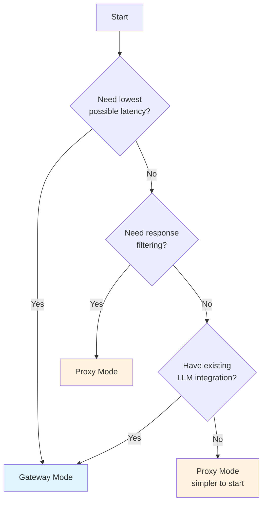
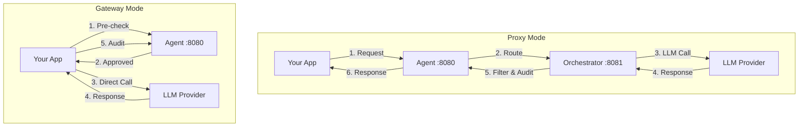
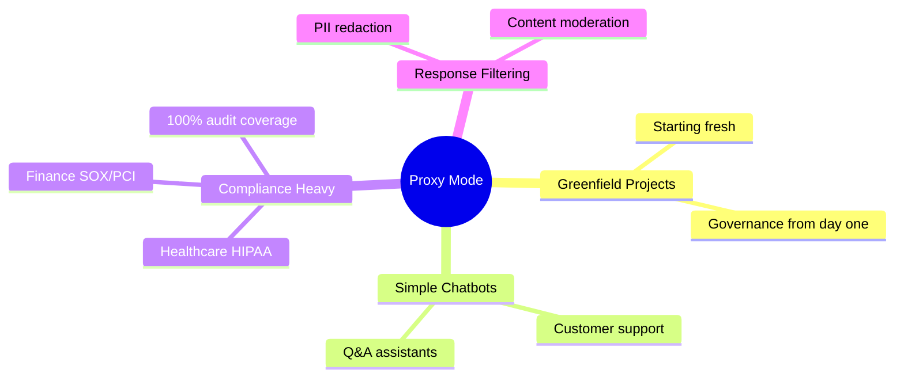
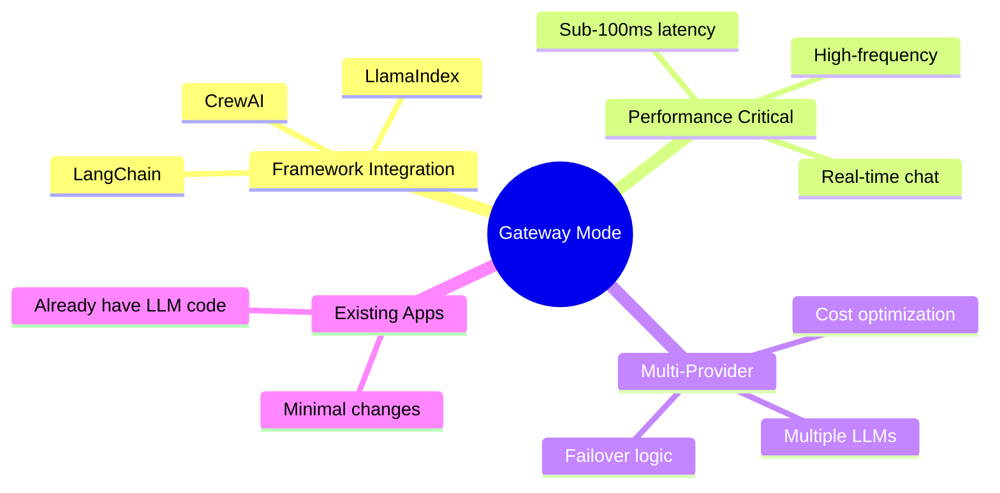
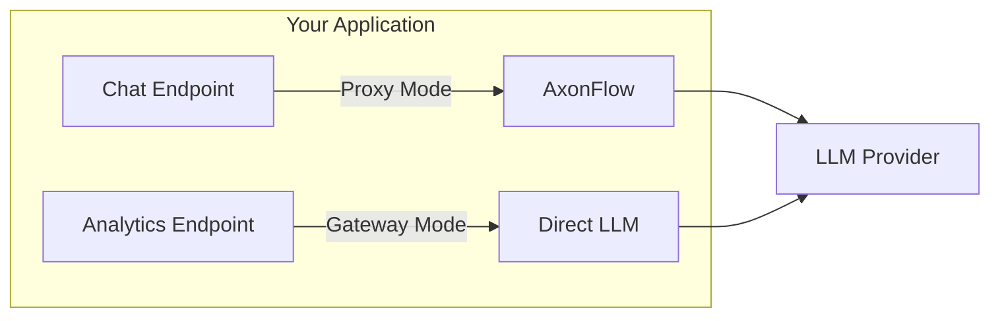
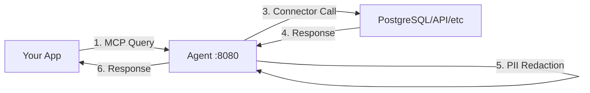

# Choosing an Integration Mode

**Last Updated:** February 2026

**Platform Version:** v4.5.0 | **SDKs:** v3.7.0

AxonFlow offers three integration modes to fit different requirements. This guide helps you choose the right one for your application.

## Overview

| Mode | Purpose | Latency |
|------|---------|---------|
| **Gateway Mode** | LLM pre-check with direct provider calls | ~15-20ms |
| **Proxy Mode** | Full LLM governance with response filtering | ~50-100ms |
| **MCP Mode** | Data connector operations (databases, APIs) | ~20-50ms |

## Quick Decision Guide


```mermaid
flowchart TD
    A[Start] --> B{Need lowest<br/>possible latency?}
    B -->|Yes| C[Gateway Mode]
    B -->|No| D{Need response<br/>filtering?}
    D -->|Yes| E[Proxy Mode]
    D -->|No| F{Have existing<br/>LLM integration?}
    F -->|Yes| C
    F -->|No| G[Proxy Mode<br/>simpler to start]

    style C fill:#e1f5fe
    style E fill:#fff3e0
    style G fill:#fff3e0
```

## Architecture Overview


```mermaid
flowchart TB
    subgraph proxy["Proxy Mode"]
        direction LR
        PA[Your App] -->|1. Request| PB[Agent :8080]
        PB -->|2. Route| PC[Orchestrator :8081]
        PC -->|3. LLM Call| PD[LLM Provider]
        PD -->|4. Response| PC
        PC -->|5. Filter & Audit| PB
        PB -->|6. Response| PA
    end

    subgraph gateway["Gateway Mode"]
        direction LR
        GA[Your App] -->|1. Pre-check| GB[Agent :8080]
        GB -->|2. Approved| GA
        GA -->|3. Direct Call| GD[LLM Provider]
        GD -->|4. Response| GA
        GA -->|5. Audit| GB
    end
```

**Key Difference:**
- **Proxy Mode**: AxonFlow sits between you and the LLM (full proxy)
- **Gateway Mode**: AxonFlow validates before/after, you call LLM directly

## Feature Comparison

| Feature | Proxy Mode | Gateway Mode |
|---------|------------|--------------|
| **Integration** | | |
| Code changes required | Minimal (wrap calls) | Moderate (pre-check + audit) |
| Learning curve | Low | Medium |
| Framework support | Good | Best (LangChain, LlamaIndex) |
| **Performance** | | |
| Latency overhead | ~50-100ms (public) / ~10-20ms (VPC) | ~10-20ms |
| Request flow | App → AxonFlow → LLM | App → LLM (direct) |
| **LLM Features** | | |
| Static policies (PII, SQLi) | Automatic | Automatic (pre-check) |
| Dynamic policies (custom rules) | Automatic | ❌ Not evaluated |
| Audit logging | 100% automatic | Manual (call audit API) |
| Response filtering | Yes (PII redaction) | No |
| Rate limiting | Automatic | Automatic (pre-check) |
| **MCP Connectors** | | |
| MCP static policies | ✅ Full | ✅ Full |
| MCP dynamic policies | ✅ Full | ✅ Full |
| MCP audit logging | ✅ Automatic | ✅ Automatic |
| **Control** | | |
| LLM provider | AxonFlow routes | You choose |
| Model selection | Limited | Full control |
| Request modification | Limited | Full control |

## When to Choose Proxy Mode

### Ideal Use Cases


```mermaid
mindmap
  root((Proxy Mode))
    Greenfield Projects
      Starting fresh
      Governance from day one
    Simple Chatbots
      Customer support
      Q&A assistants
    Compliance Heavy
      Healthcare HIPAA
      Finance SOX/PCI
      100% audit coverage
    Response Filtering
      PII redaction
      Content moderation
```

### Code Example

```typescript
// Proxy Mode - Simple, automatic governance
const response = await axonflow.protect(async () => {
  return openai.chat.completions.create({
    model: 'gpt-4',
    messages: [{ role: 'user', content: prompt }]
  });
});
// That's it! Policy, audit, filtering all handled automatically
```

## When to Choose Gateway Mode

### Ideal Use Cases


```mermaid
mindmap
  root((Gateway Mode))
    Framework Integration
      LangChain
      LlamaIndex
      CrewAI
    Performance Critical
      Sub-100ms latency
      Real-time chat
      High-frequency
    Multi-Provider
      Multiple LLMs
      Failover logic
      Cost optimization
    Existing Apps
      Already have LLM code
      Minimal changes
```

### Code Example

```typescript
// Gateway Mode - Full control, lowest latency

// 1. Pre-check (10-20ms)
const ctx = await axonflow.getPolicyApprovedContext({
  userToken: token,
  query: prompt,
  dataSources: ['postgres']
});

if (!ctx.approved) throw new Error(ctx.blockReason);

// 2. Direct LLM call (you control everything)
const response = await openai.chat.completions.create({
  model: 'gpt-4',
  messages: [{ role: 'user', content: prompt }]
});

// 3. Audit (async, non-blocking)
await axonflow.auditLLMCall({
  contextId: ctx.contextId,
  responseSummary: response.choices[0].message.content?.substring(0, 100),
  provider: 'openai',
  model: 'gpt-4',
  tokenUsage: response.usage,
  latencyMs
});
```

## Latency Comparison


```mermaid
gantt
    title Request Latency Breakdown
    dateFormat X
    axisFormat %L ms

    section Proxy Mode
    Agent Processing     :0, 20
    Orchestrator        :20, 30
    LLM Call            :30, 530
    Response Filter     :530, 540
    Total: ~540ms       :milestone, 540, 0

    section Gateway Mode
    Pre-check           :0, 15
    Direct LLM Call     :15, 515
    Audit (async)       :515, 515
    Total: ~515ms       :milestone, 515, 0
```

**Overhead Comparison:**

| Mode | AxonFlow Overhead | Notes |
|------|-------------------|-------|
| Proxy (Public) | +50-100ms | Includes response filtering |
| Proxy (VPC) | +10-20ms | Same-region deployment |
| Gateway | +10-20ms | Pre-check only, audit is async |

## Decision Matrix

| Requirement | Recommended Mode |
|-------------|------------------|
| Fastest integration | Proxy |
| Lowest latency | Gateway |
| Response filtering (PII redaction) | Proxy |
| Framework integration (LangChain) | Gateway |
| 100% automatic audit | Proxy |
| Multi-provider routing | Gateway |
| Compliance reporting | Either |
| Existing LLM code | Gateway |
| New project | Proxy (start simple) |

## Migration Paths

### Proxy → Gateway

If you start with Proxy Mode and need lower latency later:

```typescript
// Before: Proxy Mode
const response = await axonflow.protect(async () => {
  return openai.chat.completions.create({ ... });
});

// After: Gateway Mode
const ctx = await axonflow.getPolicyApprovedContext({ ... });
const response = await openai.chat.completions.create({ ... });
await axonflow.auditLLMCall({ contextId: ctx.contextId, ... });
```

### Gateway → Proxy

If you want simpler code with automatic features:

```typescript
// Before: Gateway Mode
const ctx = await axonflow.getPolicyApprovedContext({ ... });
const response = await openai.chat.completions.create({ ... });
await axonflow.auditLLMCall({ ... });

// After: Proxy Mode
const response = await axonflow.protect(async () => {
  return openai.chat.completions.create({ ... });
});
```

## Hybrid Approach

You can use both modes in the same application:


```mermaid
flowchart LR
    subgraph App["Your Application"]
        A[Chat Endpoint] -->|Proxy Mode| B[AxonFlow]
        C[Analytics Endpoint] -->|Gateway Mode| D[Direct LLM]
    end
    B --> E[LLM Provider]
    D --> E
```

```typescript
// Use Proxy Mode for simple chat (automatic everything)
app.post('/api/chat', async (req, res) => {
  const response = await axonflow.protect(async () => {
    return openai.chat.completions.create({
      model: 'gpt-4o-mini',
      messages: [{ role: 'user', content: req.body.prompt }]
    });
  });
  res.json(response);
});

// Use Gateway Mode for performance-critical analytics
app.post('/api/analyze', async (req, res) => {
  const ctx = await axonflow.getPolicyApprovedContext({
    userToken: req.headers.authorization,
    query: req.body.query,
    dataSources: ['postgres', 'snowflake']
  });

  if (!ctx.approved) {
    return res.status(403).json({ error: ctx.blockReason });
  }

  // Direct LLM call for lowest latency
  const response = await openai.chat.completions.create({ ... });

  // Fire-and-forget audit (non-blocking)
  axonflow.auditLLMCall({ contextId: ctx.contextId, ... }).catch(console.error);

  res.json(response);
});
```

## Summary

| Start With | If You Need |
|------------|-------------|
| **Proxy Mode** | Simplicity, automatic audit, response filtering, compliance |
| **Gateway Mode** | Lowest latency, full LLM control, framework integration |

**Recommendation:**
- **New projects**: Start with Proxy Mode for simplicity
- **Existing LLM code**: Use Gateway Mode for minimal changes
- **Performance critical**: Gateway Mode
- **Compliance critical**: Proxy Mode (100% automatic audit)

---

## MCP Mode (Connector Operations)

MCP (Model Context Protocol) Mode is for data connector operations - querying databases, calling APIs, and integrating with external services.

### Architecture


```mermaid
flowchart LR
    A[Your App] -->|1. MCP Query| B[Agent :8080]
    B -->|2. Policy Check| B
    B -->|3. Connector Call| C[PostgreSQL/API/etc]
    C -->|4. Response| B
    B -->|5. PII Redaction| B
    B -->|6. Response| A
```

### When to Use MCP Mode

- Querying databases (PostgreSQL, MySQL, MongoDB)
- Calling external APIs (REST, GraphQL)
- Workflow connector operations
- Data retrieval with PII protection

### Code Example

```typescript
// MCP Mode - Query connectors with full policy enforcement
const result = await axonflow.mcpQuery('postgres', `
  SELECT name, email, ssn FROM customers
  WHERE region = $1
`, ['US']);

// Response includes policy info (v3.2.0+)
console.log(`Rows: ${result.rowCount}`);
console.log(`PII redacted: ${result.redacted}`);

// Check exfiltration limits
if (result.policyInfo?.exfiltrationCheck?.withinLimits) {
  console.log('Query within limits');
}

// Check tenant policies (if enabled)
if (result.policyInfo?.dynamicPolicyInfo?.orchestratorReachable) {
  console.log(`Policies evaluated: ${result.policyInfo.dynamicPolicyInfo.policiesEvaluated}`);
}
```

### Policy Enforcement (v3.1.0+)

MCP queries go through two-phase policy evaluation:

| Phase | Checks | Action |
|-------|--------|--------|
| **REQUEST** | SQLi patterns, Critical PII in query | Block |
| **RESPONSE** | PII in data, Exfiltration limits | Redact/Block |

### Exfiltration Protection (v3.2.0+)

Configure limits to prevent large-scale data extraction:

```bash
MCP_MAX_ROWS_PER_QUERY=10000      # Default: 10,000 rows
MCP_MAX_BYTES_PER_QUERY=10485760  # Default: 10MB
```

### Tenant Policies (v3.2.0+, Optional)

Enable runtime tenant policy evaluation for rate limiting, budgets, time-based access:

```bash
MCP_DYNAMIC_POLICIES_ENABLED=true   # Enable (default: false)
MCP_DYNAMIC_POLICIES_GRACEFUL=true  # Continue if Orchestrator unavailable
```

---

## Mode Comparison Summary

| Aspect | Gateway | Proxy | MCP |
|--------|---------|-------|-----|
| **Use Case** | LLM calls | LLM calls | Data connectors |
| **Latency** | ~15-20ms | ~50-100ms | ~20-50ms |
| **INPUT Policy** | ✅ | ✅ | ✅ |
| **OUTPUT Policy** | ❌ | ✅ | ✅ |
| **PII Redaction** | ❌ | ✅ | ✅ |
| **Exfiltration Limits** | ❌ | ✅ | ✅ |
| **Tenant Policies** | ❌ | ✅ | ✅ (v3.2.0+) |
| **Control** | Full LLM | AxonFlow | Full query |

---

## Next Steps

- [Proxy Mode Guide](./proxy-mode.md) - Deep dive into Proxy Mode
- [Gateway Mode Migration Guide](./gateway-mode.md) - Deep dive into Gateway Mode
- [MCP Connector Architecture](../../technical-docs/MCP_CONNECTOR_ARCHITECTURE.md) - Full MCP architecture
- [SDK Feature Coverage](../SDK_FEATURE_COVERAGE.md) - Full method coverage matrix across all SDKs
