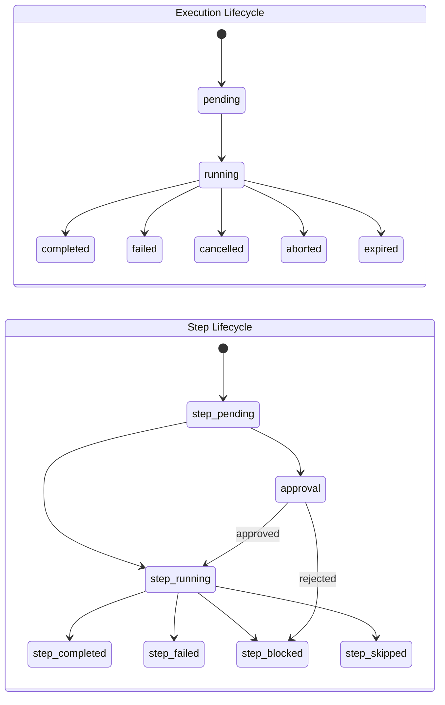

# Unified Execution Tracking

**Last Updated:** April 2026

**Platform Version:** 9.12.0 | **SDK Version:** 9.0.0

Unified Execution Tracking provides a consistent way to monitor and track the status of both MAP (Multi-Agent Planning) plans and WCP (Workflow Control Plane) workflows. This enables real-time progress monitoring, duration tracking, and cost analytics across all AxonFlow execution types.

## Overview

Before unified tracking, MAP plans and WCP workflows used separate status APIs with different response formats. This made it difficult to build unified dashboards or implement consistent monitoring across execution types.

The unified execution system provides:

1. **Consistent Status Schema** - Same response format for MAP and WCP
2. **Step-Level Progress** - Track individual step status and duration
3. **Cost Tracking** - Per-step and total cost information
4. **Real-Time Progress** - Progress percentage and elapsed duration
5. **Backward Compatibility** - Existing APIs continue to work
6. **Enterprise Portal UI** - Visual execution timeline and approval dashboard (enterprise license, see [Execution Viewer](execution-viewer.md#enterprise-portal))

## Quick Start

### Check MAP Plan Status

```bash
curl http://localhost:8081/api/v1/plan/plan_abc123
```

Response:
```json
{
  "plan_id": "plan_abc123",
  "execution_id": "plan_xyz789",
  "status": "executing",
  "query": "Research competitor pricing",
  "domain": "finance",
  "total_steps": 3,
  "completed_steps": 1,
  "progress_percent": 33.33,
  "duration": "15s",
  "steps": [
    {
      "step_id": "step_0_analyze",
      "step_index": 0,
      "step_name": "analyze",
      "step_type": "llm_call",
      "status": "completed",
      "duration": "8s",
      "model": "gpt-4o",
      "provider": "openai",
      "cost_usd": 0.02
    },
    {
      "step_id": "step_1_research",
      "step_index": 1,
      "step_name": "research",
      "step_type": "llm_call",
      "status": "running",
      "started_at": "2026-02-07T10:00:08Z"
    },
    {
      "step_id": "step_2_synthesize",
      "step_index": 2,
      "step_name": "synthesize",
      "step_type": "synthesis",
      "status": "pending"
    }
  ]
}
```

### Check WCP Workflow Status

```bash
curl http://localhost:8080/api/v1/workflows/wf_abc123
```

The response uses the same unified schema, making it easy to build monitoring dashboards that display both MAP and WCP executions.

## Status Values

### Execution Status

| Status | Description |
|--------|-------------|
| `pending` | Execution created but not yet started |
| `running` | Execution is actively processing |
| `completed` | Execution finished successfully |
| `failed` | Execution encountered an error |
| `cancelled` | Execution was manually cancelled |
| `aborted` | Execution was aborted (e.g., approval rejected) |
| `expired` | Execution timed out (MAP plans only) |

### Step Status

| Status | Description |
|--------|-------------|
| `pending` | Step has not started |
| `running` | Step is currently executing |
| `completed` | Step finished successfully |
| `failed` | Step encountered an error |
| `skipped` | Step was skipped |
| `blocked` | Step was blocked by policy |
| `approval` | Step is waiting for human approval |



## Step Types

| Type | Description |
|------|-------------|
| `llm_call` | LLM API call (OpenAI, Anthropic, etc.) |
| `tool_call` | Function/tool invocation |
| `connector_call` | MCP connector query |
| `human_task` | Human-in-the-loop task |
| `synthesis` | Result aggregation/synthesis |
| `action` | Generic action step |
| `gate` | Policy gate check (WCP) |

## SDK Examples

### TypeScript

```typescript
import { AxonFlow } from '@axonflow/sdk';

const client = new AxonFlow({
  endpoint: process.env.AXONFLOW_ENDPOINT!,
  clientId: process.env.AXONFLOW_CLIENT_ID!,
  clientSecret: process.env.AXONFLOW_CLIENT_SECRET!,
});

// Create and execute a plan
const plan = await client.plans.create({
  query: 'Analyze sales data for Q4',
  domain: 'finance'
});

// Poll for status with progress
const pollInterval = setInterval(async () => {
  const status = await client.plans.getStatus(plan.plan_id);

  console.log(`Progress: ${status.progress_percent.toFixed(1)}%`);
  console.log(`Status: ${status.status}`);
  console.log(`Duration: ${status.duration}`);

  // Show step progress
  for (const step of status.steps || []) {
    console.log(`  ${step.step_name}: ${step.status}`);
  }

  if (['completed', 'failed', 'expired'].includes(status.status)) {
    clearInterval(pollInterval);
    if (status.actual_cost_usd) {
      console.log(`Total cost: $${status.actual_cost_usd.toFixed(4)}`);
    }
  }
}, 1000);
```

### Python

```python
import os
import time
from axonflow import AxonFlow

client = AxonFlow(
    endpoint=os.environ["AXONFLOW_ENDPOINT"],
    client_id=os.environ["AXONFLOW_CLIENT_ID"],
    client_secret=os.environ["AXONFLOW_CLIENT_SECRET"],
)

# Create and execute a plan
plan = client.plans.create(
    query="Analyze sales data for Q4",
    domain="finance"
)

# Poll for status with progress
while True:
    status = client.plans.get_status(plan.plan_id)

    print(f"Progress: {status.progress_percent:.1f}%")
    print(f"Status: {status.status}")
    print(f"Duration: {status.duration}")

    # Show step progress
    for step in status.steps or []:
        print(f"  {step.step_name}: {step.status}")

    if status.status in ["completed", "failed", "expired"]:
        if status.actual_cost_usd:
            print(f"Total cost: ${status.actual_cost_usd:.4f}")
        break

    time.sleep(1)
```

### Go

```go
package main

import (
    "fmt"
    "os"
    "time"

    "github.com/getaxonflow/axonflow-sdk-go/v9"
)

func main() {
    client := axonflow.NewClient(axonflow.AxonFlowConfig{
        Endpoint:     os.Getenv("AXONFLOW_ENDPOINT"),
        ClientID:     os.Getenv("AXONFLOW_CLIENT_ID"),
        ClientSecret: os.Getenv("AXONFLOW_CLIENT_SECRET"),
    })

    // Create and execute a plan
    plan, _ := client.Plans.Create(axonflow.CreatePlanRequest{
        Query:  "Analyze sales data for Q4",
        Domain: "finance",
    })

    // Poll for status
    for {
        status, _ := client.Plans.GetStatus(plan.PlanID)

        fmt.Printf("Progress: %.1f%%\n", status.ProgressPercent)
        fmt.Printf("Status: %s\n", status.Status)
        fmt.Printf("Duration: %s\n", status.Duration)

        // Show step progress
        for _, step := range status.Steps {
            fmt.Printf("  %s: %s\n", step.StepName, step.Status)
        }

        if status.IsTerminal() {
            if status.ActualCostUSD != nil {
                fmt.Printf("Total cost: $%.4f\n", *status.ActualCostUSD)
            }
            break
        }

        time.Sleep(time.Second)
    }
}
```

### Java

```java
import com.getaxonflow.sdk.AxonFlowClient;

AxonFlowClient client = AxonFlowClient.builder()
    .endpoint(System.getenv("AXONFLOW_ENDPOINT"))
    .clientId(System.getenv("AXONFLOW_CLIENT_ID"))
    .clientSecret(System.getenv("AXONFLOW_CLIENT_SECRET"))
    .build();

// Create and execute a plan
var plan = client.plans().create("Analyze sales data for Q4", "finance");

// Poll for status
while (true) {
    var status = client.plans().getStatus(plan.getPlanId());

    System.out.printf("Progress: %.1f%%%n", status.getProgressPercent());
    System.out.printf("Status: %s%n", status.getStatus());
    System.out.printf("Duration: %s%n", status.getDuration());

    for (var step : status.getSteps()) {
        System.out.printf("  %s: %s%n", step.getStepName(), step.getStatus());
    }

    if (status.isTerminal()) {
        if (status.getActualCostUsd() != null) {
            System.out.printf("Total cost: $%.4f%n", status.getActualCostUsd());
        }
        break;
    }

    Thread.sleep(1000);
}
```

## Database Schema

The unified execution history is stored in the `unified_execution_history` table:

```sql
CREATE TABLE unified_execution_history (
    id BIGSERIAL PRIMARY KEY,
    execution_id VARCHAR(64) UNIQUE NOT NULL,
    execution_type VARCHAR(16) NOT NULL,  -- 'map' or 'wcp'
    name TEXT,
    source VARCHAR(64),
    status VARCHAR(32) NOT NULL,
    current_step_index INT DEFAULT 0,
    total_steps INT DEFAULT 0,
    steps JSONB DEFAULT '[]',
    error TEXT,
    estimated_cost_usd DECIMAL(10,6),
    actual_cost_usd DECIMAL(10,6),
    tenant_id VARCHAR(64) NOT NULL,
    org_id VARCHAR(64),
    user_id VARCHAR(64),
    client_id VARCHAR(64),
    metadata JSONB DEFAULT '{}',
    started_at TIMESTAMP WITH TIME ZONE,
    completed_at TIMESTAMP WITH TIME ZONE,
    created_at TIMESTAMP WITH TIME ZONE DEFAULT NOW(),
    updated_at TIMESTAMP WITH TIME ZONE DEFAULT NOW()
);
```

Row-Level Security ensures tenants can only access their own execution records.

## Monitoring and Dashboards

### Building a Unified Dashboard

The unified status API makes it easy to build monitoring dashboards:

```javascript
// Fetch all recent executions (both MAP and WCP)
async function fetchRecentExecutions(tenantId) {
  const [mapPlans, wcpWorkflows] = await Promise.all([
    fetch(`/api/v1/plans?limit=10`).then(r => r.json()),
    fetch(`/api/v1/workflows?limit=10`).then(r => r.json())
  ]);

  // Both responses use the same schema
  const allExecutions = [...mapPlans, ...wcpWorkflows.workflows];

  // Sort by start time
  return allExecutions.sort((a, b) =>
    new Date(b.started_at) - new Date(a.started_at)
  );
}
```

### Grafana Metrics

Execution metrics are exposed via Prometheus:

- `axonflow_executions_total{type, status}` - Total executions by type and status
- `axonflow_execution_duration_seconds{type}` - Execution duration histogram
- `axonflow_execution_steps_total{type, step_type}` - Steps executed by type
- `axonflow_execution_cost_usd{type}` - Cost by execution type

See the [Grafana Dashboard Guide](./grafana-dashboard.md) for pre-built dashboards.

## Best Practices

### 1. Poll with Exponential Backoff

For long-running executions, use exponential backoff to reduce API load:

```typescript
async function pollWithBackoff(planId: string, maxWait = 30000) {
  let delay = 500;

  while (true) {
    const status = await client.plans.getStatus(planId);

    if (status.isTerminal()) {
      return status;
    }

    await new Promise(r => setTimeout(r, delay));
    delay = Math.min(delay * 1.5, maxWait);
  }
}
```

### 2. Use Webhooks for Real-Time Updates (Enterprise)

For real-time status updates without polling, configure webhooks:

```json
{
  "webhook_url": "https://your-app.com/webhooks/axonflow",
  "events": ["execution.completed", "execution.failed", "step.completed"]
}
```

### 3. Correlate with External Systems

Use the `metadata` field to store external correlation IDs:

```bash
curl -X POST http://localhost:8081/api/v1/plans \
  -d '{
    "query": "Generate report",
    "metadata": {
      "external_request_id": "req_12345",
      "triggered_by": "scheduler"
    }
  }'
```

## Troubleshooting

### Execution Stuck in "pending"

1. Check if the orchestrator service is running
2. Verify the plan hasn't expired (check `expires_at`)
3. Check orchestrator logs for errors

### Steps Not Showing Progress

1. Ensure the execution was started (not just created)
2. For WCP, steps only appear after step gate checks
3. Check for policy blocks that may halt execution

### Cost Information Missing

1. Cost is only tracked for LLM calls with provider billing
2. Self-hosted models (Ollama) don't report cost
3. Check that the provider SDK is configured for cost tracking
